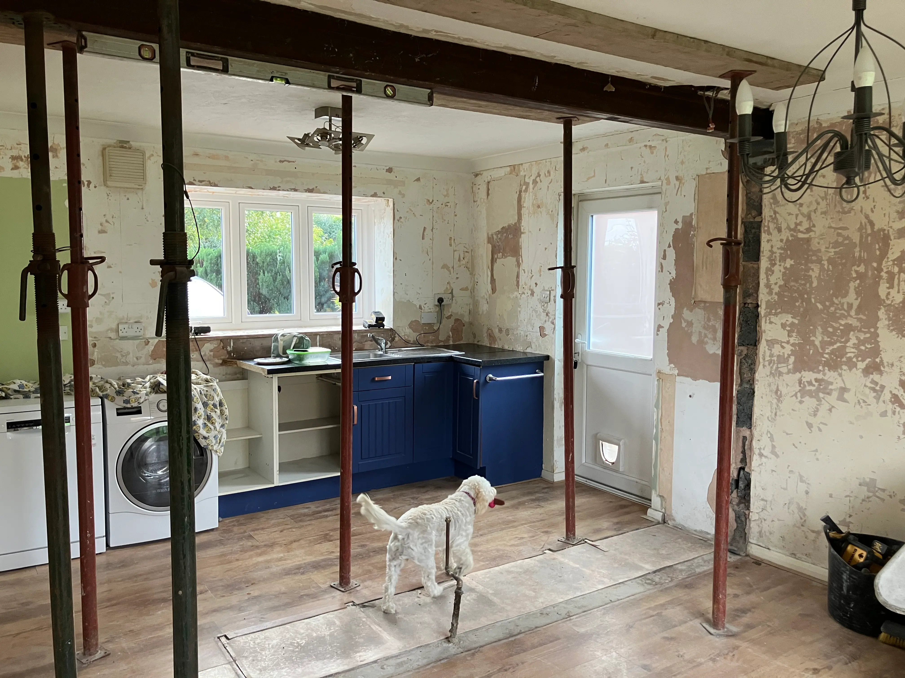
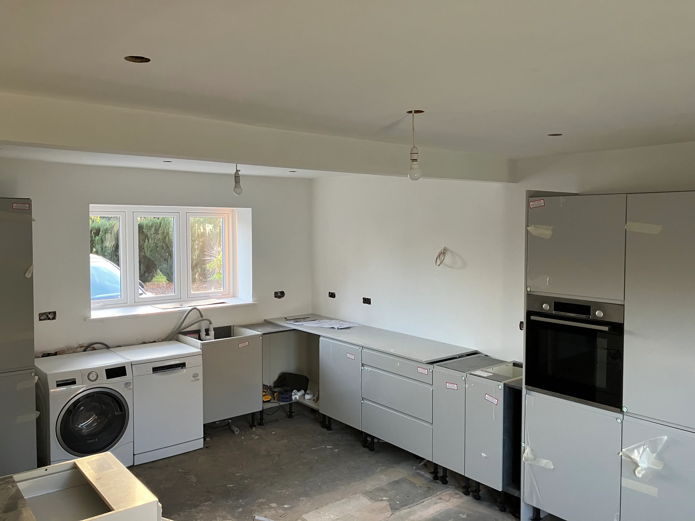
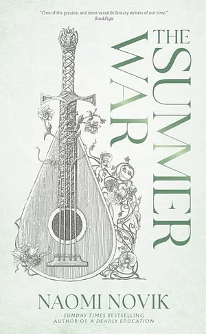

+++
title = 'November 2025 Update'
date = 2025-11-22T13:14:30Z
tags = ['life']
featured_image = '01000047.webp'
+++
Life has been a little hectic lately, and so I've not been able to write as much as I would like to have done. I've still got the series I was working on which needs the next post writing, and there are some things I've been working on which I'd like to cover as well. But for now I thought I'd write a quick update on what's been going on, technically and personally.

## What have I been up to?

Well, thanks for asking.

### Kitchen mania

Things have been manic in the house at the moment while we're (finally) changing the kitchen. This was something we started to try and do about 5 years ago, though the scope was much smaller then. It didn't happen at the time because of money, time, and the builder just disappearing off the face of the planet. So, we've been waiting and growing the plans to the point where we could start.

So, we've had the wall between the kitchen took down, and we're turning the old kitchen and dining room into a single open space. We had to have the fridge-freezer in the dining room before anyway because of space.

TO say it's been a long process would not quite cover it, and we've been using the conservatory as a temporary kitchen during the work. It's not the best space, but it's a space and means we've been able to make meals at least.

But it's getting there. All the major structural work is done and units are going in. So hopefully we'll have a kitchen soon, even if we're likely to have to wait until the new year to get the flooring in.

### Taking a break

While we were waiting for work to start, we were able to take a break over in Herefordshire, where we stayed in a great cottage in the middle of nowhere. We were lucky with the weather, and there is nothing better than laying on the ground outside on a clear night with very little light pollution and just watching the cosmos for hours on end.

While we were there we visited a number of places, one of which was [Goodrich Castle](https://www.english-heritage.org.uk/visit/places/goodrich-castle/), which is fascinating to look around and explore the history of, especially the part it played in the English civil war and the defeat of the royalists (and yet we still have a monarchy damnit!)

## Books

I don't post nearly enough about books, and I've certainly not been reading anywhere near enough lately, but here's a bit of a run-down on my most recent reads.

### The Summer War - Naomi Novik

I love pretty much everything I read of Naomi's, and this was no exception. [The Summer War](https://www.penguinrandomhouse.com/books/788200/the-summer-war-by-naomi-novik/) tells the story of Celia and her brothers, the eldest of which she curses to wander the world seeking only fame instead of the love and belonging he truly longs for. Words in this story have meaning, and they have power, and peoples lives are upended through cunning and trickery based solely on those words.

If you loved Uprooted and Spinning Silver then this is definitely for you.

### Anderson versus Death - Anna Smith Spark

I got genuinely excited when I saw this posted by [Grimdark Magazine](https://www.grimdarkmagazine.com/review-anderson-versus-death/). A new book from the Queen of Grimdark, and it's in the Judge Dredd universe, specifically Psi-Judge Cas Anderson.

This story revolves around Judge Death and what happens after Anderson traps him inside her mind, saving the day but sacrificing herself. She lays encased in a polymer tomb while the story unfolds between the two of them in her own mind.

This is an incredible space for Anna Smith Spark to play in and do what she does best, which is to explore that grey area between what makes us good people, and how easily those lines are broken. And in Megacity One that line is precariously trodden each and every day.

I picked up the audiobook version of this one, which was an extra delight as it's narrated by the author herself. I've listened to a few books narrated by the authors, such as this one, others by Adrian Tchaikovsky, and Yahtzee Crowshaw. There are some incredible narrators out there, but it's always different when the author does it themselves as there's that deeper understanding of what a character is doing, thinking, and feeling at any point in time which gives the narration something a little extra.

### The Fellowship of the Ring - J.R.R Tolkien

My son is a teenager now, but we still read together almost every night. The books have changed over the years from The Gruffalo, to books like this.

We had previously finished The Hobbit, and I was telling him about the Silmarillion and the lore of Middle Earth. At this point he got pretty interested and wanted to dive into the Lord of the Rings. So how could I possibly say no?

He had tried to read some of The Silmarillion, but it's a hard-going book, and he didn't make it too far, but he read enough that he could call out some of the lore here, and I helped with some more of the rest.

We got through it, and we're straight on to The Two Towers, which we're currently in the middle of the battle of Helms Deep.

### Buying books

I quit Audible earlier in the year and moved over to [Libro.fm](https://libro.fm), and swapped my Kindle for a [Kobo](https://www.kobo.com). Getting audiobooks can be a bit of a pain, but that's mostly due to exclusivity deals with Audible. It's not something I'd even blame authors for, they need to do what is right for them, and most books are available after a short wait, and I've got to say I much prefer Libro.fm to Audible.

The Kobo ecosystem is much less locked down, which means I'm able to buy ebooks directly, or from other stores and load them up. Using tools such as [Calibre](https://calibre-ebook.com) makes it even easier and can convert into the kepub format which is epub with some Kobo extensions so you get things like reading stats on the device.

Finally, most physical books I'm buying now are coming from [Hive](https://www.hive.co.uk) which is a great store and supports independent bookstores by contributing part of the sale to a participating store of your choice.

## And the tech?!

Well, it wouldn't be me if there wasn't something I was looking into or playing with, though it's been slower recently given the chaos of everything else.

### Snub

In a couple of recent posts I've mentioned a side project I've been working on called [snub](https://codeberg.org/dazfuller/snub) which is a command line utility for generating gitignore files. Born out of a frustration of not having a tool available to work the way I wanted. So I've been working on building it out which has given me a chance to play with [Go](https://go.dev) some more, and I got a decent tool out of it.

### AI

It seems you can't go 5 minutes without some post turning up about AI, or some tool cramming it in. I use [JetBrains](https://www.jetbrains.com) tools for coding which now comes with various AI components integrated, some more useful than others. I seem to have to keep updating my settings to get the balance right. Their full-line-code-completion features are actually pretty good, and the models are small and run locally. They're pretty good at helping me to complete boilerplate code and certainly help out. The "cloud" based ones... less so. I'm writing this post in [Goland](https://www.jetbrains.com/go/) at the moment, and had to spend a while changing the config so that the cloud-based "next edit" feature would stop kicking in and trying to write the post for me. Mostly for 2 reasons, first because I don't want it to, and second because it's wrong.

The "wrong" part is something I always run up against. Every once in a while I'll try out some coding agents to see if they're actually of any use, and pretty much every single time they produce content which is just wrong.

I'm sure the tech bros will be screaming out how I'm not writing the prompts well enough or some other shit. But honestly, if you have to put that much effort into writing the prompts, then why not just write the code in the first bloody place. The sheer amount of brain rot from this is astounding.

And while I'm on a bit of a rant (I know, such a change for me). I've seen so many posts lately from people who aren't from a software background talking about how they've got into "programming" because they can just describe what they want the AI to produce. And sure, it's written some code for them and I'm sure they feel great about it. But if I started posting about how I was getting into their field of expertise because I could just ask the AI to do it for me, they'd be screaming out about qualifications, or best practice, etc... And the fact that they hold software development in such contempt just really pisses me off.

I could probably build a house by asking an AI what I should be doing. Should I though? Definitely not, because it would be an accident waiting to happen.

AI (and I mean all aspects, not just LLMs) can have a place in what we do, but it's a tool, and like any tool it needs to be evaluated and used in the right way. At the moment the world seems to be in the "I have a hammer so everything is a nail" mentality.

### Advent of code

If you genuinely want to get into programming and have some fun doing it, then we're a few short days away from [Advent of Code](https://adventofcode.com). Many people use this as a way to learn a new language, or brush up on skills for ones they already know.

I'm hoping I'm going to get some time again this year to at least do some of the challenges. It's great fun, and if you post up onto various non-toxic social media platforms, it's a great way of meeting like-minded people.

### GoAccess

Now I've moved away from using an Azure Static Web App to hosting this site using [Hetzner](https://www.hetzner.com) I've been able to start accessing web logs, which then led out to me wondering how to best visualise them. Hetzner provide their own reports, but I wanted something else, and I found [GoAccess](https://goaccess.io). I really recommend checking it out as it produces some great metrics and visuals.
