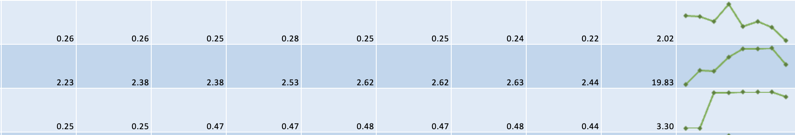

+++
title = 'Azure Costs CLI tool - Adding a Spark'
date = 2024-05-30T10:07:48+01:00
tags = ['open source', 'golang', 'azure']
featured_image = 'azcosts-sparklines-banner.webp'
+++
I've had a few days off lately, so thought I'd spend some time adding some new features to the [Azure Costs](/projects/azcosts) CLI tool I've been writing and using.

## Quick recap

I wrote the CLI tool as a quick and easy way for me to collect and monitor spend in Azure at a resource group level (I'm planning on going to resource level next, but that's a future update). Importantly I wanted to maintain the collected data so I could analyze it later, and so that I could produce outputs showing me how spend has changed month-on-month.

I wrote it using [Go](https://go.dev) because I wanted to use a different language. I spend most of my work time writing code using C# or Python, and sometimes in Scala, plus a bunch of scripting languages, so I wanted something different for a personal project.

One of my team took an early Python prototype I did and this project and created an [Azure Function](https://learn.microsoft.com/azure/azure-functions/functions-overview) app which sends out an email every Sunday with the last 3 months of spend data. So it's nice that this inspired something so useful already :heart_eyes:.

## So what's new?

When I started I had collected the previous couple of months of data and the latest month and things were pretty easy to see, but after a couple more months being able to visualise the changes just from a wall of numbers was getting more difficult.

I could have added a chart to sheet but with the number of resource groups we have it would be just as difficult to visualise. So, I decided to add spark lines.

One of the other things I decided to do was to summarise the values up to the subscription level as well so I could see which subscriptions were costing the most and how their spend changed over time.

### Spark lines?

Spark lines are basically simple little charts which you put inline with the data. They're useful for visualising trends on a row-by-row basis, letting people quickly scan data looking for trends their interested in (such as spikes or upwards trends) so that they can look at the data they're interested in instead of hunting it down.



## Adding in the spark lines

This was actully incredibly easy to do thanks to the library I'm using called [Excelize](https://xuri.me/excelize/), and for once it's been nice to do something with Excel that didn't need me to write the library :laughing:. It's quite simply this.

```golang
func (ef ExcelFormatter) addSparkLines(f *excelize.File, sheetName string, fixedCellCount int) error {
	rows, _ := f.GetRows(sheetName)
    cols, _ := f.GetCols(sheetName)
    lastColumn, _ := excelize.ColumnNumberToName(len(cols))
    startDataColumn, _ := excelize.ColumnNumberToName(fixedCellCount + 1)
    lastDataColumn, _ := excelize.ColumnNumberToName(len(cols) - 2)

    var sparkLineLocation []string
    var sparkLineRange []string
    for i := range rows {
        if i < 1 {
            continue
        }

        ri := i + 1

        location, _ := excelize.JoinCellName(lastColumn, ri)
        start, _ := excelize.JoinCellName(startDataColumn, ri)
        end, _ := excelize.JoinCellName(lastDataColumn, ri)

        sparkLineLocation = append(sparkLineLocation, location)
        sparkLineRange = append(sparkLineRange, fmt.Sprintf("%s!%s:%s", sheetName, start, end))
    }

    return f.AddSparkline(sheetName, &excelize.SparklineOptions{
        Location: sparkLineLocation,
        Range:    sparkLineRange,
        Markers:  true,
        Type:     "line",
        Style:    18,
    })
}
```

The process is pretty simple. The method assumes that the sheet has a structure of `[fixed cells][data cells][spark line cell]` (which they do), so calling the method you tell it which sheet, and how many fixed cells there are and it then works out the data cell range. It then goes over each of the rows (excluding the header row) and creates 2 strings. The first is the `sparkLineLocation` string which says where the spark line is going, and the second is the `sparkLineRange` string which defines the range of cells which make up the data. This last string would look something like `Sheet1!A1:F1`.

Once it's built up a list of locations and ranges it adds them to the Excel file being generated, along with some options defining how the spark lines should look.

And that's it, job done. The code was also changed to add in a "Subscriptions" sheet which also used the same method to add spark lines for each subscription.

## Other formats

The tool supports outputting the generated report to Text, CSV, and JSON, as well as Excel. The Text and CSV formats haven't changed as they're intended to show a single table of data, and having spent years building data platform, there's nothing more frustrating than getting a CSV file which contains multiple tables (queue internal screaming).

The JSON output was modified though to have a new top-level property called "subscriptions" which shows the month-by-month spend at the subscription level.

Ultimately these other formats exist so that the tool can sit in automated pipelines and be used to export data into a format to support down-stream processes. In those instances being able to summarise to a subscription level is pretty easy. For example, I use [Nushell](https://www.nushell.sh) as my shell of choice, and you can do this pretty easily directly from the terminal using something like this.

```shell
azcosts generate -format json -stdout
    | from json
    | get resourceGroups
    | select subscriptionName totalCost
    | into float totalCost
    | polars into-df
    | polars group-by subscriptionName
    | polars agg [(polars col totalCost | polars sum)]
    | polars collect
```

Which seems like a lot, but simply gets the parts of the JSON we're interested in, shapes the data, and then uses the data-frame methods to sum the `totalCost` by subscription.

_(Incidentally, you should definitely check out Nushell(https://www.nushell.sh) if you spend any time working in the terminal)_

## Getting hold of it

During the changes I reported a [bug](https://github.com/qax-os/excelize/issues/1910) to the creators of Excelize as the spark lines were being added on multiple sheets. They picked it up and resolved it on the same day which was very cool, but right now the code is pointing the the main branch, so I'm going to wait until the v2.9.0 release which includes the fix properly before releasing.

But, the pipelines are up and working so when it's all merged in the pipeline will generate binaries for Windows, Linux, and Mac for both x86_64 and Arm architectures which can be downloaded and executed.
