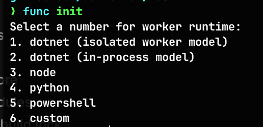

+++
title = 'Azure Functions - Timer Trigger with Go'
date = 2024-11-30T12:52:17Z
tags = ['azure', 'golang', 'energy']
featured_image = 'sleeping-dogs.png'
+++
I've seen a couple of posts/videos lately where people have been saying that you can't do [timer triggers](https://learn.microsoft.com/azure/azure-functions/functions-bindings-timer) in Azure Functions using [Golang](https://go.dev) (or, any other language outside of C#, Python, Java, JS/TS). This mostly seems to be because the documentation doesn't list Go or other languages in it.

This is a bit of an issue with the documentation, because it is absolutely possible to do this in Go, Rust, or any other language that has HTTP primatives available to it. This is all capable through the use of Azure Functions [Custom Handlers](https://learn.microsoft.com/azure/azure-functions/functions-custom-handlers).

The short version of them is this. An Azure Function app consists of a host, and then a handler which supports HTTP primatives. The "supported" languages handle this interaction for you, but any other language is capable of being used as the Function App host forwards an HTTP request to the handler to handle the request.

The majority of documentation for things like quick starts always look at using HTTP triggers, but rarely cover much else, so it's easy to be confused by this unless you know what to look for.

So, in this post I'm going to walk through creating a Timer Triggered Azure Function, which collects data from an API, and then writes it to an Azure Storage Table instance using an output binding, so my code doesn't have to interact with any Azure services directly.

If you want to go straight to the full code you can find it over on [Codeberg](https://codeberg.org/dazfuller/timer-trigger-demo).

## The API

Really the timer trigger could do anything. But using them to poll a data source and collect the latest data is a pretty common use case, so we're going to do that. The API we're going to use is the UK's [National Energy System Operator](https://carbonintensity.org.uk) (NESO), and it's the API which gives us the [energy generation mix](https://carbon-intensity.github.io/api-definitions/#generation) information detailing what percentage of the countries energy supply is coming from which fuel type.

It's a good API to use as it's free to access and doesn't require any sign-up process, so we can skip authentication for this example.

## The data store

As I mentioned, we're going to store this data in an Azure Storage Table. This is such an under-rated service in Azure and really deserves way more love than it gets. It can hold up to 500TiB per table, and can handle 20 thousand transactions per second against the storage account (2000 per second for a single table). There are always design considerations and they need some planning, but they are performant and pretty damn cheap.

So, we're going to create a really simple table, it's partition key is going to be "national" because it's national data and the volume for the partition is really low. The row key is going to be formed using the from and to dates, ensuring we only get 1 entry for each 30 minute period, and then we'll store the values for each fuel type. So a single record every 30 minutes.

## Getting started

I'm going to use an existing Go function app I've created before, but if you're starting from scratch then you will need to create a new directory and run `func init` (assuming you have the [Azure Function Core Tools](https://learn.microsoft.com/azure/azure-functions/functions-run-local) installed), and then choose the "custom handler" option.



And then run `go mod init` to initialize a new go module.

We're going to create an executable called `app` in the source root directory, so in the `hosts.json` file set the `defaultExecutablePath` value to be `"app"` and add a new property after the `description` object to be `"enableForwardingHttpRequest": true`. So it should look like this.

_N.B._ If you're following along on Windows then make sure you set `app` to be `app.exe` here and elsewhere in this post.


Okay, so we can now add our timer trigger function. To do this we're going to use the core tools again with `func new` and then select the "Timer trigger" option. We can then give it any name we want, so I'm going to use `uk-generation-mix`.


This will create a new sub-directory called `uk-generation-mix` which will contain a `function.json` file. This file is where we define the cron schedule, and where we'll define our bindings later on.

I'm going to be using [JetBrains IntelliJ](https://www.jetbrains.com/idea/) to write our code in, but you can use anything you want, like NeoVim, VSCode, Sublime Text etc... There's no right tool, just whatever you're comfortable with.

## Handling the timer trigger

As I mentioned earlier, the Azure Function host will make an HTTP request to our application to handle the trigger. So we're going to need to create an endpoint for our timer trigger. The endpoint is the name of our function, so in our case we need to listen for requests on `/uk-generation-mix`. So lets do that.

First, lets create a `cmd` sub-directory under the root direction, and then in there lets create a `main.go` file. If you prefer the Cobra style, then you could create a `main.go` in the root which imports an execute function from `root.go` under cmd. But I'm going to keep things a bit simpler here.

Once we've got our `main.go` file lets add our HTTP handler.

The Azure Function host can use an environment variable called `FUNCTIONS_CUSTOMHANDLER_PORT` to tell our app which port to listen on, so we'll need to check for that and then use port 8080 if it's not set.

```go
package main

import (
	"fmt"
	"log"
	"net/http"
	"os"
)

func main() {
	listenAddr := ":8080"
	if val, ok := os.LookupEnv("FUNCTIONS_CUSTOMHANDLER_PORT"); ok {
		listenAddr = fmt.Sprintf(":%s", val)
	}

	http.HandleFunc("/uk-generation-mix", internal.GenerationMixHandler)

	log.Fatal(http.ListenAndServe(listenAddr, nil))
}
```

Here we're setting the default port, checking to see if the environment variable is set and using that port instead if it is. Then we create our handler for the timer trigger endpoint, and then we start listening for requests.

So, now we need to write the actual handler, as you'll see that Go is complaining that it doesn't exist yet.

So, lets create another sub-directory under the root called `internal` and then under there lets create a new file called `generationmix.go`. Once we have that then lets start to implement the handler. Don't forget to add the import to `main.go` once you're done.

```go
package internal

import (
	"encoding/json"
	"fmt"
	"io"
	"log"
	"net/http"
)

type InvokeResponse struct {
	Outputs     map[string]interface{}
	Logs        []string
	ReturnValue interface{}
}

func GenerationMixHandler(w http.ResponseWriter, r *http.Request) {
	log.Println("Handling generation mix request")

	reqBody, _ := io.ReadAll(r.Body)
	fmt.Println(string(reqBody))

	invokeResponse := InvokeResponse{
		Outputs:     nil,
		Logs:        nil,
		ReturnValue: nil}

	responseJson, _ := json.Marshal(invokeResponse)

	w.Header().Set("Content-Type", "application/json")
	w.Write(responseJson)
}
```

There's a couple of things happening in here. The first is that we're reading the request body and writing it out. There's no actual need to do that, and for this example we can ignore the request body, but this is here so you can see the body sent to the handler by the Azure Function host.

We're then creating an `InvokeResponse` instance, marshalling it into JSON, and then writing that (and a content-type header) to the response writer. The Azure Function host will be expecting a response from the handler so it knows that it's finished, but right now we're not doing anything, so we're returning an empty structure in the shape which the host is expecting (which you can see in the [documentation](https://learn.microsoft.com/azure/azure-functions/functions-custom-handlers)).

## First run

You should now have a code base which looks a bit like this.

```text
/
|- cmd
|  |- main.go
|- internal
|  |- generationmix.go
|- uk-generation-mix
|  |- function.json
|- go.mod
|- host.json
|- local.settings.json
```

There's a couple more things we need to set up. The first is a storage account, because a timer trigger needs to be able to record some state. You can either use an Azure Storage Account, or if you want to run it all locally you can use [Azurite](https://learn.microsoft.com/azure/storage/common/storage-use-azurite). I'm going to use Azurite for this, so in a new terminal tab and from the source root, I'm going to run the following.

```bash
> azurite --location ./azurite/
```

This will start Azurite, and write any data to a local folder called `azurite`. I can then add this to my `.gitignore` file so it's not included and doesn't clutter up my code base. I can then set the `AzureWebJobsStorage` setting in the `local.settings.json` file to `UseDevelopmentStorage=true` or to a full length string.

```json
{
  "IsEncrypted": false,
  "Values": {
    "FUNCTIONS_WORKER_RUNTIME": "custom",
    "AzureWebJobsStorage": "DefaultEndpointsProtocol=http;AccountName=devstoreaccount1;AccountKey=Eby8vdM02xNOcqFlqUwJPLlmEtlCDXJ1OUzFT50uSRZ6IFsuFq2UVErCz4I6tq/K1SZFPTOtr/KBHBeksoGMGw==;BlobEndpoint=http://127.0.0.1:10000/devstoreaccount1;QueueEndpoint=http://127.0.0.1:10001/devstoreaccount1;TableEndpoint=http://127.0.0.1:10002/devstoreaccount1;"
  }
}
```

Don't worry, this isn't a secret key here, it's a fixed key for Azurite and you can find it in the Microsoft documentation.

I tend to prefer the full connection string as some tooling can get funny about the `UseDevelopmentStorage` option.

For now, we'll also add the following to the `uk-generation-mix/function.json` file. `"runOnStartup": true`.

```json
{
  "bindings": [
    {
      "name": "myTimer",
      "type": "timerTrigger",
      "direction": "in",
      "schedule": "0 */5 * * * *",
      "runOnStartup": true
    }
  ]
}
```

Next, we need to build our application, otherwise the function host won't have anything to run.

```bash
> go build -o app cmd/main.go
```

If there are no errors then we can start the function app with the following command.

```bash
> func start
```

What you should see is the function listed, and then it executing, and some JSON output that looks a little like this (I've tidied it up here to make it easier to read)

```json
{
    "Data": {
        "myTimer": {
            "Schedule": {
                "AdjustForDST": true
            },
            "ScheduleStatus": {
                "Last": "0001-01-01T00:00:00",
                "Next": "2024-11-30T14:45:51+00:00",
                "LastUpdated": "2024-11-30T14:43:50.403838+00:00"
            },
            "IsPastDue": false
        }
    },
    "Metadata": {
        "sys": {
            "MethodName": "uk-generation-mix",
            "UtcNow": "2024-11-30T14:43:50.46239Z",
            "RandGuid": "fa3b2fbc-26ed-4fcb-be75-82db8773b519"
        }
    }
}
```

This is the request body sent to our handler. Under `Data` there is a `myTimer` property which matches the name of the trigger in our `function.json` file. We then get information about DST, schedules, and if it has triggered after when it was due. We also get some information about function call in the `Metadata` object.

So, this is actually the bulk of the work done. We've got our handler, and the function host is calling it. Just remember to build the application before you run each time, otherwise you'll just confuse yourself as to why your change isn't being applied :laughing:

One of the things I do is create a Make file or Just file and put the commands in there, so I can call `just run` and have it build and then start the function app for me.

When you're done you can press CTRL+C to terminate the function app.

## Collecting data from the API

Next thing we want to do is collect data from the [NESO API](https://carbon-intensity.github.io/api-definitions/#generation), we'll do this and then we'll look at output bindings.

As this isn't a tutorial on calling APIs with Go we're going to get through this part pretty quickly. So lets create a new directory under `internal` called `apis` and then create a file called `carbonintensity.go`. In there lets use the following code.

```go
package apis

import (
	"encoding/json"
	"log"
	"net/http"
	"time"
)

// NESOTime is a struct that embeds time.Time to provide custom JSON unmarshalling.
type NESOTime struct {
	time.Time
}

// UnmarshalJSON decodes a JSON representation of a timestamp into a NESOTime object using the format "2006-01-02T15:04Z".
func (t *NESOTime) UnmarshalJSON(b []byte) error {
	var timestamp string
	err := json.Unmarshal(b, &timestamp)
	if err != nil {
		return err
	}
	parsedTime, err := time.Parse("2006-01-02T15:04Z", timestamp)
	if err != nil {
		return err
	}
	t.Time = parsedTime
	return nil
}

// GenerationMixResponse represents the root response structure containing generation mix data.
type GenerationMixResponse struct {
	Data GenerationMixData `json:"data"`
}

// GenerationMixData represents electricity generation mix data with a specified time range. It contains fields for
// the start and end timestamps and a list of generation mix percentages by fuel type.
type GenerationMixData struct {
	From          NESOTime        `json:"from"`
	To            NESOTime        `json:"to"`
	GenerationMix []GenerationMix `json:"generationmix"`
}

// GenerationMix represents the mix of electricity generated from a particular fuel type. It includes the name of the
// fuel and its percentage contribution to the total generation mix.
type GenerationMix struct {
	Fuel       string  `json:"fuel"`
	Percentage float64 `json:"perc"`
}

func LoadGenerationMixData() (*GenerationMixData, error) {
	log.Println("loading generation mix data")
	req, _ := http.NewRequest("GET", "https://api.carbonintensity.org.uk/generation", nil)
	req.Header.Add("Accept", "application/json")

	log.Printf("making request to %s", req.URL.String())
	httpClient := &http.Client{}

	resp, err := httpClient.Do(req)
	if err != nil {
		return nil, err
	}
	defer resp.Body.Close()

	log.Println("response status:", resp.Status)
	var generationMixResponse GenerationMixResponse
	err = json.NewDecoder(resp.Body).Decode(&generationMixResponse)
	if err != nil {
		return nil, err
	}

	return &generationMixResponse.Data, nil
}
```

This is pretty straight forward, with one quirk that we have to handle the timestamps slightly differently as the API returns them in the format of `2018-01-20T12:30Z`, so we need to make sure they can be read correctly.

We can then change our `GenerationMixHandler` method to look like this (remember the import).

```go
func GenerationMixHandler(w http.ResponseWriter, r *http.Request) {
	log.Println("Handling generation mix request")

	reqBody, _ := io.ReadAll(r.Body)
	fmt.Println(string(reqBody))

	generationMixData, err := apis.LoadGenerationMixData()
	if err != nil {
		w.WriteHeader(http.StatusBadRequest)
		log.Println(err)
		return
	}

	log.Printf("Got generation mix data: %v", generationMixData)

	invokeResponse := InvokeResponse{
		Outputs:     nil,
		Logs:        nil,
		ReturnValue: nil}

	responseJson, _ := json.Marshal(invokeResponse)

	w.Header().Set("Content-Type", "application/json")
	w.Write(responseJson)
}
```

If you run the function app again now you'll see it making the request and giving a fairly simple dump of the data. If you're seeing a 200 response, but not any data then check the URL in the API. This is one of those annoying APIs which return a 200, but with an error code in the response body.

## Saving to the Storage Table

Remember the `function.json` file? Well, it's time to go and update it again to include our output binding. So, open it up and then change it to look like this.

```json
{
  "bindings": [
    {
      "name": "myTimer",
      "type": "timerTrigger",
      "direction": "in",
      "schedule": "0 */5 * * * *",
      "runOnStartup": false
    },
    {
      "tableName": "generationmix",
      "connection": "AzureWebJobsStorage",
      "name": "generationTable",
      "type": "table",
      "direction": "out"
    }
  ]
}
```

What we've done here is to add an output binding of type `table`. We've defined the table name we want to write to as `generationmix`, and the connection string we're going to use is `AzureWebJobsStorage` which is taken from the settings. If you want to save to a different table (which you should for anything going near a production system) then add a different connection string to local.settings.json and then use that.

This is an [Azure Tables Output Binding](https://learn.microsoft.com/azure/azure-functions/functions-bindings-storage-table-output), and much like the timer trigger it doesn't say how to use it for custom handlers (YAY). But, down in the "Usage" section for the "Azure Tables extension" we can see the following statement.

> Functions attempts to serialize a plain-old CLR object (POCO) type as the entity. The type must implement [ITableEntity] or have a string RowKey property and a string PartitionKey property.

Well, we're not using C# so we can't implement the `ITableEntity` interface, but it does say _"or have a string RowKey property and a string PartitionKey property"_. And that we can definitely do.

So, lets create our table entity struct in our `generationmix.go` file.

```go
type GenerationMixEntity struct {
	PartitionKey string
	RowKey       string
	From         time.Time
	To           time.Time
	BioMass      float64
	Coal         float64
	Imports      float64
	Gas          float64
	Nuclear      float64
	Hydro        float64
	Solar        float64
	Wind         float64
	Other        float64
}
```

We've given it a string partition key and string row key. The partition key gives us which partition to write to, and the row key is the unique value for this _row_ of data. Then we're going to save the from and to times, and the values for all of the fuel types.

Now we need to convert our API response data into this format and we can write it out. But first, lets create a helper function on our `GenerationMixData` type in the `carbonintensity.go` file.

```go
// GetPercentage returns the percentage of electricity generated by the specified fuel type.
// If the fuel type is not found, it returns 0.0.
func (gmd *GenerationMixData) GetPercentage(fuel string) float64 {
	for _, gm := range gmd.GenerationMix {
		if gm.Fuel == fuel {
			return gm.Percentage
		}
	}
	return 0.0
}
```

This is going to allow us to get the percentage by fuel type, and if it doesn't exist then we'll simply get a zero value back.

Back in our `generationmix.go` file lets create a new function called `generationMixToTableEntity`

```go
func generationMixToTableEntity(data apis.GenerationMixData) GenerationMixEntity {
	fromKey := data.From.Format("200601020304")
	toKey := data.To.Format("200601020304")

	return GenerationMixEntity{
		PartitionKey: "national",
		RowKey:       fmt.Sprintf("%v-%v", fromKey, toKey),
		From:         data.From.Time,
		To:           data.To.Time,
		BioMass:      data.GetPercentage("biomass"),
		Coal:         data.GetPercentage("coal"),
		Imports:      data.GetPercentage("imports"),
		Gas:          data.GetPercentage("gas"),
		Nuclear:      data.GetPercentage("nuclear"),
		Hydro:        data.GetPercentage("hydro"),
		Solar:        data.GetPercentage("solar"),
		Wind:         data.GetPercentage("wind"),
		Other:        data.GetPercentage("other"),
	}
}
```

As mentioned earlier, we're setting the partition key to "national" because, well, it is. We're then setting the row key to be a string made up from the from and to timestamps. Then we add in all of the percentages using the helper method we just added.

Now to get our function app to write this to the storage table.

We're already returning our `InvokeResponse` object, so we need to modify it to add our generation mix data. To do that we need to add it to our `Outputs` field which is a map of strings to interfaces{}. The important part here is that we add an entry with the name of our output binding `generationTable` if you check the `function.json` file. So lets add this to our handler in the `generationmix.go` file.

```go
func GenerationMixHandler(w http.ResponseWriter, r *http.Request) {
	log.Println("Handling generation mix request")

	reqBody, _ := io.ReadAll(r.Body)
	fmt.Println(string(reqBody))

	generationMixData, err := apis.LoadGenerationMixData()
	if err != nil {
		w.WriteHeader(http.StatusBadRequest)
		log.Println(err)
		return
	}

	log.Printf("Got generation mix data: %v", generationMixData)
	log.Println("Creating table entity")

	generationMixEntity := generationMixToTableEntity(*generationMixData)

	outputs := make(map[string]interface{})
	outputs["generationTable"] = generationMixEntity

	invokeResponse := InvokeResponse{
		Outputs:     outputs,
		Logs:        nil,
		ReturnValue: nil}

	responseJson, _ := json.Marshal(invokeResponse)

	w.Header().Set("Content-Type", "application/json")
	w.Write(responseJson)
}
```

And lets run it again.

Once it's executed you can check in the storage account using [Azure Storage Explorer](https://azure.microsoft.com/products/storage/storage-explorer/) (which works with Azurite). Just terminate after the first run, it will run every 5 minutes right now which is fine as subsequent writes for the same time period will just show as errors, but nobody likes to see errors.


And that's it. We've got our Azure Function app, written using Go, being triggered by a timer, and then writing to a storage table using an output binding.

## Wrapping up

Next steps from here would be to look at running this in Azure, so you would want to change the cron schedule in the `function.json` file so it runs every 30 minutes, but a little bit after, so maybe 5 minutes past and 35 minutes past the hour.

You might want to add more logging, better error handling etc... If you connect your function app to an [App Insights](https://learn.microsoft.com/azure/azure-monitor/app/app-insights-overview) instance, then all of those logs will be written there as well.

Maybe you want to add more output bindings so you send the data to multiple places.

There are a lot of things you can do from here, but it is all possible using Go, or any other language with HTTP primitives. It just takes some perseverance with the official documentation.