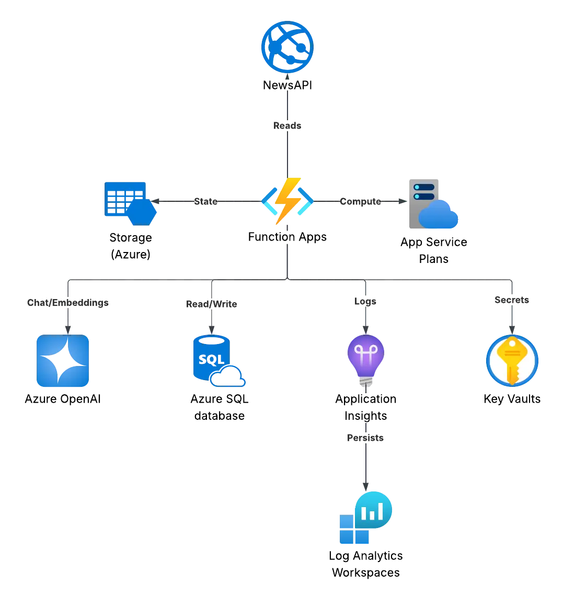
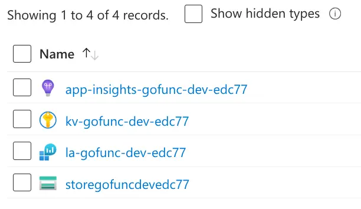
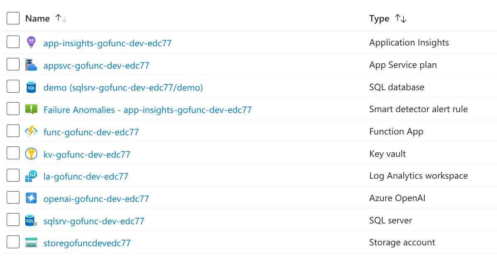
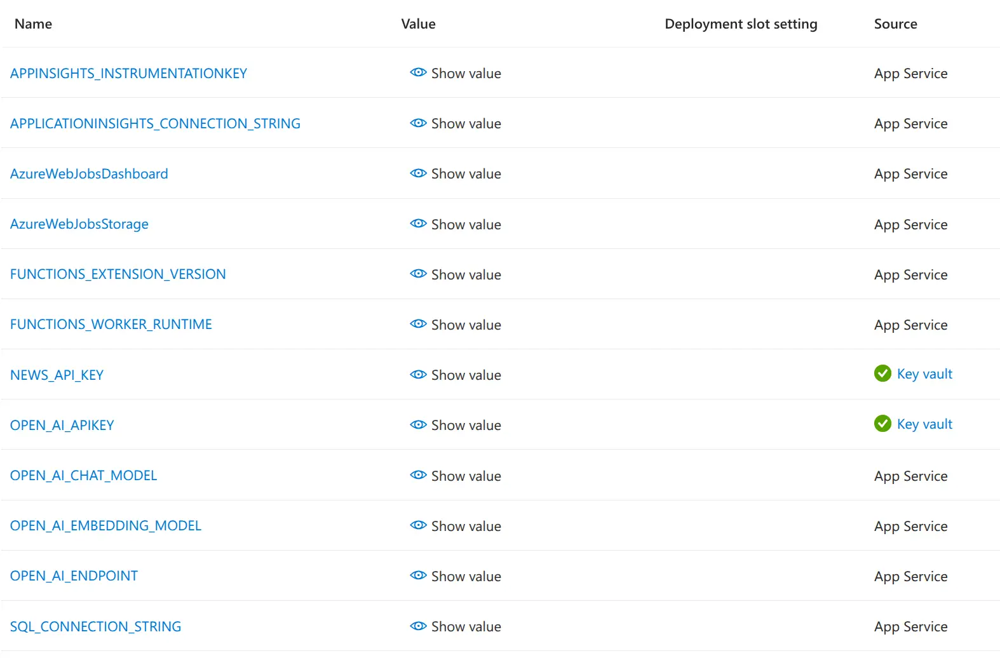
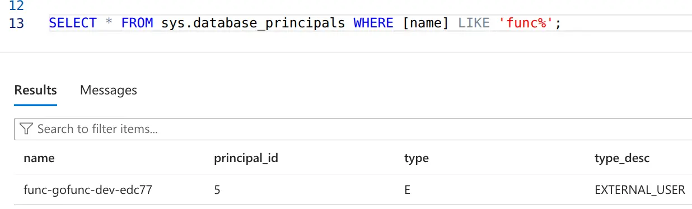

+++
title = 'Go Function App: Creating the resources'
date = 2025-08-09T16:27:32+01:00
tags = ['Golang', 'Azure', 'HCL', 'Bicep']
series = ['Building and Deploying a Go Function App']
series_order = 1
featured_image = 'tofu-header.webp'
+++
I've done a couple of posts before on running [Go](https://go.dev) in [Azure Functions](https://learn.microsoft.com/azure/azure-functions/functions-custom-handlers) through the custom handler feature. This is an incredibly powerful feature which lets you write your handler code in any language you want, as long as it supports HTTP primitives.

The thing which always felt missing to me is that I've never pulled together different aspects of the process, from setting up the environment, building the code, deploying, and monitoring. So that's what I'm hoping to achieve with this series.

In this first part we're going to start by building out the target environment. We'll be doing this through Infrastructure-as-Code using [HCL](https://github.com/hashicorp/hcl) (the Hashicorp Configuration Language), though I'll be using [OpenTofu](https://opentofu.org) for running commands. Though there will be a [bicep](https://learn.microsoft.com/azure/azure-resource-manager/bicep/overview) version as well, and I'll explain the differences between them where they exist.

So, lets dive in.

> If you want to just go look at the code then you can find it over on [Codeberg](https://codeberg.org/dazfuller/go-func-sql/src/branch/main/infrastucture)

## What are we building?

We're going to build a simple application that will have the following features.

* Collect headlines from [NewsAPI](https://newsapi.org/) on a timed trigger
* Save the headlines to a SQL database, generating embeddings for each article
* Create APIs for
  * Listing headlines
  * Searching headlines
  * Generating a summary of headlines based on a user question

Whilst Azure Functions and SQL will form a large part of the solution, we're going to need supporting services for monitoring and security as well.

## Planning the resources

Let's start with the core services.

Azure Functions seems pretty straight forward, but we're going to need a little bit more. A Function App needs an [Azure App Service](https://learn.microsoft.com/azure/app-service/overview) to back it, so we'll need to deploy one of those. It also needs a storage account to persist data and to use queues and tables if you use [Durable Functions](https://learn.microsoft.com/azure/azure-functions/durable/durable-functions-overview).

We also want to monitor the solution, so we are going to need to deploy an [App Insights](https://learn.microsoft.com/azure/azure-monitor/app/app-insights-overview) instance. These require a [Log Analytics](https://learn.microsoft.com/azure/azure-monitor/logs/log-analytics-overview) workspace to back them, so that's another resource needed.

We're going to need to store configuration information for the Function App, these can go into the environment settings, but we shouldn't be storing secrets there (such as the NewsAPI key), best practice here is that we store these values in an [Azure KeyVault](https://learn.microsoft.com/azure/key-vault/general/overview) instance and create links to it from the Function App.

Phew, that's quite a lot from the Function App, but don't worry, there's not a lot more.

Next up we have the [Azure SQL](https://learn.microsoft.com/azure/azure-sql/database/sql-database-paas-overview) database. This is easier as the only dependent service we'll need is an Azure SQL Server instance. We'll need to store the connection details in the KeyVault instance, but we've already got that covered.

Finally, we'll need an [Azure OpenAI](https://learn.microsoft.com/azure/ai-foundry/what-is-azure-ai-foundry) instance (Azure AI Foundry). We're going to deploy a Chat model and an Embeddings model to this as part of the deployment. We'll need to store the model deployment names in the Function App environment settings, and we'll need to store the API key in the KeyVault instance and create a reference to it for the Function App.



## Getting started

This is going to follow a directory structure already laid out in the Git repo which goes with this series. If you want to follow along, you can clone the repo from [Codeberg](https://codeberg.org/dazfuller/go-func-sql).

The directory structure we have is

```text
/
infrastructure
  - bicep
  - hcl
scripts
```

Okay, let's first set up our basic files. We're going to need a `providers.tf` file, a `variables.tf` file, and a `main.tf` file in the `infrastructure/hcl` folder. The first thing we'll do is configure our providers.

That file is going to look like this.

```terraform
terraform {
  required_providers {
    azurerm = {
      source  = "hashicorp/azurerm"
      version = "~>4.35.0"
    }
    http = {
      source  = "hashicorp/http"
      version = "~>3.4.5"
    }
  }
}

provider "azurerm" {
  features {
    key_vault {
      purge_soft_deleted_secrets_on_destroy = true
      recover_soft_deleted_key_vaults       = true
    }
  }
  subscription_id              = var.subscription
  disable_terraform_partner_id = true
}
```

Here we're saying we require the `azurerm` provider and the `http` provider (you'll find out more about the http provider soon). The `azurerm` provider is what we'll use to create all of our Azure resources. The version at the time of writing is/was 4.35.0, but we prefix it with the `~>` modifier, that means that the "right-most" part of the version can change. So 4.35.1 or 4.35.2 can be downloaded instead, but not 4.36.0.

In our features section for `azurerm` we're configuring some defaults for KeyVault, such as saying that when an instance is destroyed it should also be purged (because KeyVault supports a soft delete), and that it should attempt to recover a soft-deleted version if one exists instead of trying to create a new one with the same name, which would give us an error.

We have to define the subscription we're deploying to, so we'll pull that from our variables in case we want to deploy to different subscriptions.

We'll also prevent it from adding the terraform partner id, because I just don't want it to add it.

So let's add the variable to our variables file (variables.tf) otherwise it'll complain.

```terraform
variable "subscription" {
  type        = string
  description = "The id of the subscription to deploy to"
  validation {
    condition     = length(var.subscription) > 0
    error_message = "A subscription id must be provided"
  }
}
```

This is a simple entry which defines the variable and says that its length should be greater than 0 (so it's required).

Now we can update our main.tf file.

## Adding resources

Let's talk about naming a second. Naming things is hard! What makes it harder with Azure is that some resources have to have a globally unique name, and some resources are very limited in the length of their names, like storage accounts. Many organisations like to set standardised naming conventions to make naming things easier, and it's a pretty good idea (except when they apply it to database names in the same way, there's a special place in hell for that), as it means we know how to name things, and it makes finding them easier later. But it doesn't get us around the globally unique naming issue. So one of the things I tend to like to do is apply a unique suffix to each resource. It helps keep things unique, and if we base the unique value on the resource group id (not the name), then we get two extra benefits.

1. All resources in the group will share the same suffix
2. If we delete the resource group and then re-deploy it to the same location, we get the same names back
   1. But if we deploy to a resource group with a different name or in a different subscription, we get a different suffix value

Let's have a go at doing this.

We're going to need a few more items in our variable file first, these will be the name of the resource group, the location, lifecycle stage, and a short name.

```terraform
variable "resource_group_name" {
  type        = string
  description = "The name of the resource group to which resources are deployed"
  validation {
    condition     = length(var.resource_group_name) >= 3
    error_message = "The resource group name must be at least 3 characters in length"
  }
}

variable "location" {
  type        = string
  description = "Default location for resources to be deployed in"
  default     = "uksouth"
}

variable "lifecycle_stage" {
  type        = string
  description = "The lifecycle of the deployment"
  validation {
    condition     = contains(["dev", "test", "prod"], var.lifecycle_stage)
    error_message = "Valid values for lifecycle are (dev, test, prod)"
  }
}

variable "short_name" {
  type        = string
  description = "The short name of the project for resource naming (e.g. mycoolapp)"
  validation {
    condition     = can(regex("[a-z0-9]{3,10}", var.short_name))
    error_message = "Short name should be between 3 and 10 characters in length and contain only numbers and lower-case letters"
  }
}
```

We could have created the resource group name following a naming convention, but for a little simplicity in this series I figured we'd just use a name of our own choosing. What it does require, though, is that the name is at least three characters long.

The location is the default location for resources to be deployed in. Here I'm defaulting it to the UK South region, because that's where I am (the UK), but you can change it to whichever makes more sense for you.

The lifecycle allows us to specify if we're doing a dev, test, or production deployment. This is useful not only for naming but also because we might want to choose different scale options between the environments.

Finally, we have a short name. This is the piece of text which lets us quickly identify what the resource is for when we're looking at resources in the portal, cli, or other endpoints. I'm specifying that it should be between 3 and 10 characters in length, and it should only contain numbers and lower-case letters. The lower-case is important as not all resources allow mixed case names.

In our `main.tf` file we'll now add the following.

```terraform
locals {
  resource_suffix = substr(sha512(azurerm_resource_group.rg.id), 0, 5)
}

resource "azurerm_resource_group" "rg" {
  name     = var.resource_group_name
  location = var.location

  tags = {
    Lifecycle : var.lifecycle_stage
    Project : var.short_name
  }
}
```

The `resource_suffix` local variable is a simple function which takes the id code of the resource group, creates a SHA512 hash of it, and then takes the first five characters. It's fairly similar in approach to the bicep/ARM `uniqueString` function, but as that's not documented, I came up with this approach. The important thing is that it's deterministic, so if you re-run the deployment, it will always give the same result. We take the first five characters of the hash to save on space and because it's "unique enough".

_N.B._ If you're using the Bicep script instead, you'll see it's using the `uniqueString` function instead.

### Naming convention

All the resources we deploy from this point on will follow the same naming convention. This will be in the following format.

`<resource_type>-<short_name>-<lifecycle_stage>-<resource_suffix>`

Some resources do not support hyphens, so for those we'll use the same structure just minus the hyphen.

`<resource_type><short_name><lifecycle_stage><resource_suffix>`

### Application Insights

First up, we're going to create our Application Insights instance, which is used in a few places. So this, along with storage accounts, would normally be the first things I would script.

```terraform
resource "azurerm_log_analytics_workspace" "law" {
  name                       = "la-${var.short_name}-${var.lifecycle_stage}-${local.resource_suffix}"
  resource_group_name        = azurerm_resource_group.rg.name
  location                   = azurerm_resource_group.rg.location
  sku                        = "PerGB2018"
  retention_in_days          = 30
  internet_ingestion_enabled = true
  internet_query_enabled     = true
}

resource "azurerm_application_insights" "app_insights" {
  name                       = "app-insights-${var.short_name}-${var.lifecycle_stage}-${local.resource_suffix}"
  resource_group_name        = azurerm_resource_group.rg.name
  location                   = azurerm_resource_group.rg.location
  application_type           = "web"
  workspace_id               = azurerm_log_analytics_workspace.law.id
  internet_ingestion_enabled = true
  internet_query_enabled     = true
}
```

Application Insight instances have to be backed by a Log Analytics workspace, so we define that first and then move on to the Application Insights instance.

It's not a particularly complicated resource. We're using the Per GB SKU, which is about as basic as we can get, and we're setting a retention period of 30 days. This is all to keep costs down, but you can change it to whatever works best for you.

In the Application Insights instance you'll see we're referencing the Log Analytics workspace, by doing this we ensure that the Log Analytics workspace is created first as it's a dependency.

### Storage Account

Our function app will need a storage account, so we're going to script that next. It's a simple storage account as we don't have any special requirements.

```terraform
resource "azurerm_storage_account" "func_store" {
  name                     = "store${var.short_name}${var.lifecycle_stage}${local.resource_suffix}"
  location                 = azurerm_resource_group.rg.location
  resource_group_name      = azurerm_resource_group.rg.name
  account_tier             = "Standard"
  account_replication_type = "LRS"
}
```

That's it, a simple storage account with local redundancy.

### KeyVault

Okay, now things get a little more interesting. We need to set up our KeyVault and put in the secrets we need for our application to run. We're also going to need to set up RBAC so that the different services can access the secrets.

We need to put in two secrets. One for the NewsAPI key, and one for the OpenAI API key. The OpenAI key isn't available yet, so we'll have to add that later, but we can add the NewsAPI key now. First thing is to add a variable to our `variables.tf` file.

```terraform
variable "news_api_key" {
  type        = string
  description = "API Key for the News API source"
  validation {
    condition     = length(var.news_api_key) > 0
    error_message = "A news API key must be provided"
  }
}
```

Once that's in we can add the KeyVault resource to our `main.tf` file.

```terraform
resource "azurerm_key_vault" "kv" {
  name                            = "kv-${var.short_name}-${var.lifecycle_stage}-${local.resource_suffix}"
  location                        = azurerm_resource_group.rg.location
  resource_group_name             = azurerm_resource_group.rg.name
  sku_name                        = "standard"
  tenant_id                       = data.azurerm_client_config.current.tenant_id
  enable_rbac_authorization       = true
  enabled_for_deployment          = false
  enabled_for_disk_encryption     = false
  enabled_for_template_deployment = false
}

resource "azurerm_key_vault_secret" "news_api_secret" {
  name         = "NewsApiKey"
  key_vault_id = azurerm_key_vault.kv.id
  value        = var.news_api_key
}
```

The first thing we do is create the resource itself. We're configuring it using a "standard" SKU, and we have to specify the tenant id. We actually need to add another entry to the top of our `main.tf` file to make this work.

```terraform
data "azurerm_client_config" "current" {}
```

This is a data source which returns the current client configuration, which includes the tenant id.

After this we enable RBAC for authorisation, instead of the more classic access policies, this is really just best practice now. We also disable the instance for deployments and disk encryption as we don't need those, we also disable template deployments for the same reason.

Next we add our NewsAPI key to the KeyVault as a secret. We specify the KeyVault instance it's being added to, the name of the secret, and the value.

Now, if we were to try and implement this now, we'd get an error as we'd be unable to add the secret. This is because when the deployment happens, it will be under the local user account, and that account doesn't have RBAC permissions.

If you're used to using Bicep, this will seem a little odd as it's not a problem there. This is because Bicep pushes the deployment to the Azure Resource Manager, which handles this for us. But for Terraform we're going to have to assign our deploying user permissions. So, first things first, we need to add another data source to our `main.tf` file.

```terraform
data "azuread_user" "current_user" {
  object_id = data.azurerm_client_config.current.object_id
}
```

This data source returns the information about the current user. Once we have that, we can add our RBAC assignment to the KeyVault.

```terraform
resource "azurerm_role_assignment" "deployment_kv_admin" {
  scope                = azurerm_key_vault.kv.id
  role_definition_name = "Key Vault Administrator"
  principal_id         = data.azuread_user.current_user.object_id
  principal_type       = "User"
}
```

This creates a role assignment for the current user as a "Key Vault Administrator", allowing the deploying user to fully administer the KeyVault instance.

Now, let's go back to our NewsAPI key secret and update it to the following.

```terraform
resource "azurerm_key_vault_secret" "news_api_secret" {
  name         = "NewsApiKey"
  key_vault_id = azurerm_key_vault.kv.id
  value        = var.news_api_key
  depends_on = [
    azurerm_role_assignment.deployment_kv_admin
  ]
}
```

What we've done is to add a dependency on the role assignment. We have to be explicit about this as the secret type doesn't have any other way of referencing it, but with this added it will ensure that the role assignment is performed before it attempts to create the secret.

### Quick sanity check

Let's give this a quick sanity check by deploying what we've got so far.

I've created a new file in the same folder called `dev.tfvars` and added my values in for the different variables we've defined. It looks like this (without the actual secrets, of course).

```terraform
subscription = "6b4676ac-aaaa-bbbb-cccc-ddddeeeeffff"
resource_group_name = "rg-uks-gofunc-dev"
location = "uksouth"
lifecycle_stage = "dev"
short_name = "gofunc"
news_api_key = "ImNotTellingYou"
```

First, let's format the files by running the following command in the same folder as our terraform files. This is just to make things look nice.

```bash
> tofu fmt
```

Now, before we do anything else, make sure you have the Azure CLI installed and logged in. If you do, then we can plan our deployment. If your login has expired, you'll get errors about the azuread block needing configuring or the Azure CLI version not being able to be parsed. If that happens then run `az login` to log back in.

```bash
> tofu plan -var-file dev.tfvars -out dev.tfplan
```

This will plan the deployment using our variable file, and output the plan to a file called `dev.tfplan`.

Everything should have been planned correctly, and you should see quite a lengthy output which looks a little like this.

```text
Plan: 7 to add, 0 to change, 0 to destroy.

Saved the plan to: dev.tfplan

To perform exactly these actions, run the following command to apply:
    tofu apply "dev.tfplan"
```

We can then do what it says and apply the plan by running the following command.

```bash
> tofu apply "dev.tfplan"
```

This might take a little while as some resources aren't that quick to create. Once it's done, we should see the following output.

```text
Apply complete! Resources: 7 added, 0 changed, 0 destroyed.
```

You can also check in the portal to see the resources which have been created and check the role assignments.



Right, sanity check done, lets get the remaining resources added.

### SQL Server

We need a SQL Server instance and a database in it to store the data we're collecting. It doesn't need to be a big database as we're running this just for us, so lets keep it small and cheap for now. We're also going to add a SQL administrator to the instance. Normally it's best practice to use only Entra ID-based authentication, but for this we'll enable it as a way of logging in later if we need to.

Let's add a couple more variables to hold our SQL admin username and password.

```terraform
variable "sql_server_admin_user" {
  type        = string
  description = "Admin username for the SQL server instance"
  default     = "demoadmin"
  validation {
    condition     = length(var.sql_server_admin_user) > 0
    error_message = "Admin username must be set"
  }
}

variable "sql_server_admin_password" {
  type        = string
  description = "Admin password for the SQL server instance"
  validation {
    condition     = length(var.sql_server_admin_password) > 8
    error_message = "Admin password must be greater than 8 characters in length"
  }
}
```

It goes without saying that we don't want to add a default value for the admin password.

Because we're going to want to connect to the SQL database after we've deployed it, we're going to need to add a firewall rule to allow access, as Azure SQL by default blocks all inbound access. To do this, we're going to call an API as a data source and then use the output from that to create our firewall rule.

So, at the top of our `main.tf` file, we're going to add the following.

```terraform
data "http" "ip" {
  url = "https://api.ipify.org?format=text"
}
```

Here we're using the http data source provider to allow us to make HTTP-based calls. We use this to call the IPify API to get our public IP address. You can run this in your browser to see the output, but it's just a simple text response with our IPv4 address.

Right, on to creating the resources.

```terraform
resource "azurerm_mssql_server" "sql_server" {
  name                = "sqlsrv-${var.short_name}-${var.lifecycle_stage}-${local.resource_suffix}"
  location            = azurerm_resource_group.rg.location
  resource_group_name = azurerm_resource_group.rg.name
  version             = "12.0"
  azuread_administrator {
    login_username              = data.azuread_user.current_user.user_principal_name
    object_id                   = data.azuread_user.current_user.object_id
    azuread_authentication_only = false
  }
  administrator_login          = var.sql_server_admin_user
  administrator_login_password = var.sql_server_admin_password
  minimum_tls_version          = "1.2"
}
```

This is our Server instance configuration. You can see we're setting the Azure AD (Entra now) administrator to be our current user. Ideally, in a real world scenario we would use a security group which people could be added to, but for our purposes here this will be just fine. We're also explicitly setting the minimum TLS version to 1.2, which at the time of writing is the highest version supported (1.3 not being available yet).

```terraform
resource "azurerm_mssql_firewall_rule" "sql_firewall_allow_azure" {
  name             = "AllowAzureServices"
  server_id        = azurerm_mssql_server.sql_server.id
  start_ip_address = "0.0.0.0"
  end_ip_address   = "0.0.0.0"
}

resource "azurerm_mssql_firewall_rule" "sql_firewall_current_location" {
  name             = "AllowDeployment"
  server_id        = azurerm_mssql_server.sql_server.id
  start_ip_address = data.http.ip.response_body
  end_ip_address   = data.http.ip.response_body
}
```

Next we create two firewall rules. The first one allows access from all Azure services, without it resources like Function Apps wouldn't be able to connect. The second rule is the one using our HTTP data source to set our current IP address with access.

```terraform
resource "azurerm_mssql_database" "demo_db" {
  name      = "demo"
  server_id = azurerm_mssql_server.sql_server.id
  collation = "SQL_Latin1_General_CP1_CI_AS"
  sku_name  = "S0"
}
```

Finally, we have our database. We're calling it "demo" (not using a naming standard, because it's a database), setting the collation information, and setting the SKU to an S0, which is 1 above the basic tier.

If you wanted to, you could sanity check the script by running the plan and apply commands again. Remember to update the variable file with the new values for the SQL server admin username and password.

### Azure OpenAI

We're going to be building a simple RAG (Retrieve, Augment, Generate) application, and so we're going to need to use a couple of things from Azure OpenAI. We'll need an LLM to handle the generation of responses to user questions. But before we get to that, we'll need to generate embeddings for the different articles we collect so that we can use SQL as our vector store. To support this, we're going to create an Azure Cognitive Services instance and deploy two models to it, one LLM, and one embedding model.

```terraform
resource "azurerm_cognitive_account" "openai" {
  name                = "openai-${var.short_name}-${var.lifecycle_stage}-${local.resource_suffix}"
  location            = azurerm_resource_group.rg.location
  resource_group_name = azurerm_resource_group.rg.name
  kind                = "OpenAI"
  sku_name            = "S0"
}

resource "azurerm_cognitive_deployment" "chat" {
  name                 = "func-chat-model"
  cognitive_account_id = azurerm_cognitive_account.openai.id

  model {
    format = "OpenAI"
    name   = "gpt-4.1-mini"
  }

  sku {
    name     = "GlobalStandard"
    capacity = 30
  }

  version_upgrade_option = "OnceNewDefaultVersionAvailable"
}

resource "azurerm_cognitive_deployment" "embedding" {
  name                 = "func-embedding-model"
  cognitive_account_id = azurerm_cognitive_account.openai.id

  model {
    format = "OpenAI"
    name   = "text-embedding-3-small"
  }

  sku {
    name     = "GlobalStandard"
    capacity = 100
  }
}
```

The cognitive services instance is pretty straightforward, it's an "OpenAI" type of instance and with an S0 SKU (the only SKU). And that's it.

Next we deploy our LLM to the instance. The model we're using is a GPT 4.1 mini and with a capacity of 30 (which actually means 30,000 tokens per minute throughput). We're going to use the Global Standard SKU to make sure we have some capacity (not all regions are equal), and we're going to set our version upgrade option to "OnceNewDefaultVersionAvailable", which means that when Microsoft makes a new version the default, then our instance will be automatically upgraded. The embedding model is the same but does not need the upgrade settings.

Both of these have a fixed name, which is important. When we connect later on in the code, we'll refer to the names of the deployments rather than the model names.

There's one last thing we need to do before we can deploy our function app. We need to create a KeyVault secret for the OpenAI API key.

```terraform
resource "azurerm_key_vault_secret" "openai_api_key" {
  name         = "OpenAiApiKey"
  key_vault_id = azurerm_key_vault.kv.id
  value        = azurerm_cognitive_account.openai.primary_access_key
  depends_on = [
    azurerm_role_assignment.deployment_kv_admin
  ]
}
```

Again, we're making sure that the role assignment for the deploying user is done before we create the secret.

### Function App

The final resource to add is the function app. This is where we'll be deploying our code later and, based on the diagram above, the centre of our application.

A function app first needs an App Service Plan, which is the resource that will be hosting the app for us.

```terraform
resource "azurerm_service_plan" "func_app_service_plan" {
  name                = "appsvc-${var.short_name}-${var.lifecycle_stage}-${local.resource_suffix}"
  location            = azurerm_resource_group.rg.location
  resource_group_name = azurerm_resource_group.rg.name
  os_type             = "Linux"
  sku_name            = "P0v3"
}
```

Here we're deploying a Linux-based app service plan with a P0v3 SKU, which is a premium SKU capable of hosting eight applications, with one vCPU, 4GB of RAM, and 250GB of storage.

Okay, now for the chunky one, the function app itself.

```terraform
resource "azurerm_linux_function_app" "func_app" {
  name                = "func-${var.short_name}-${var.lifecycle_stage}-${local.resource_suffix}"
  location            = azurerm_resource_group.rg.location
  resource_group_name = azurerm_resource_group.rg.name
  service_plan_id     = azurerm_service_plan.func_app_service_plan.id

  storage_account_name       = azurerm_storage_account.func_store.name
  storage_account_access_key = azurerm_storage_account.func_store.primary_access_key

  https_only = true
  enabled    = true
  identity {
    type = "SystemAssigned"
  }

  site_config {
    scm_minimum_tls_version                = "1.3"
    minimum_tls_version                    = "1.3"
    http2_enabled                          = true
    worker_count                           = 1
    ftps_state                             = "Disabled"
    always_on                              = true
    application_insights_key               = azurerm_application_insights.app_insights.instrumentation_key
    application_insights_connection_string = azurerm_application_insights.app_insights.connection_string
    application_stack {
      use_custom_runtime = true
    }
    cors {
      allowed_origins = [
        "https://portal.azure.com"
      ]
      support_credentials = false
    }
  }

  app_settings = {
    "OPEN_AI_ENDPOINT"        = azurerm_cognitive_account.openai.endpoint
    "OPEN_AI_APIKEY"          = "@Microsoft.KeyVault(SecretUri=${azurerm_key_vault.kv.vault_uri}secrets/${azurerm_key_vault_secret.openai_api_key.name})"
    "OPEN_AI_CHAT_MODEL"      = azurerm_cognitive_deployment.chat.name
    "OPEN_AI_EMBEDDING_MODEL" = azurerm_cognitive_deployment.embedding.name
    "SQL_CONNECTION_STRING"   = "sqlserver://${azurerm_mssql_server.sql_server.fully_qualified_domain_name}?database=${azurerm_mssql_database.demo_db.name}&fedauth=ActiveDirectoryDefault"
    "NEWS_API_KEY"            = "@Microsoft.KeyVault(SecretUri=${azurerm_key_vault.kv.vault_uri}secrets/${azurerm_key_vault_secret.news_api_secret.name})"
  }
}
```

There is quite a lot happening in here, so let's break it down a little.

The first section should be pretty obvious; it's defining the name and location of the resource, the app service plan to use, and the storage account the function app will be using. One of the nice things about the Terraform module is that it will use the storage information to generate the necessary environment settings for us when it's being deployed.

We're then saying that the function app should be HTTPS only. Really, this should be the default for all deployments anyway, but it never hurts to be explicit. We're also enabling the function app and saying that we want a system assigned managed identity. That identity is how we're going to connect to the SQL database and KeyVault instances.

Okay, the site config.

We're explicitly setting the minimum TLS versions to 1.3 and enabling HTTP/2. It's not a busy app, so we can keep the worker count at 1. We're disabling FTPS access (not using it), and we're saying that we want it to always be on. We then set the application insight settings so that it's collecting all the telemetry from our function app.

The **supermassive important** setting for us is the `application_stack`. We're setting this to `custom` as we're going to be deploying a [Go](https://go.dev) application later on.

Finally, we're setting CORS for the function app to allow us to use the Azure Portal to test out our functions.

That just leaves our App Settings block. This is where we specify all the environment variables that we want to set for our function app. Most are values we're pulling from other resources we've deployed, such as the Azure OpenAI instances endpoint. The SQL connection string we're using is a little different to how we might normally set them, but this is for us to use in Go, so we need it in this format.

For the OPEN_AI_APIKEY and NEWS_API_KEY we're using a KeyVault secret reference. This means that the function app will retrieve the value from KeyVault rather than us specifying it here. Much better for security as we're restricting who can see our secrets.

There are a couple of formats for these, but the one we're using is this one

`@Microsoft.KeyVault(SecretUri=<key vault uri>/secrets/<secret name>)`

We could specify the secret version as well, but if we don't, then it will use the latest version, which is the behaviour we want.

### Connecting it all

Right now we could deploy all the resources, and it would look great (in fact, you're more than welcome to, I would as I typically test early and often). But it wouldn't work!

We need to sort out some permissions first. Specifically, the function app needs to be able to access the KeyVault, and it needs to be able to access the SQL database.

The KeyVault access is pretty straightforward, so lets start there.

```terraform
resource "azurerm_role_assignment" "func_app_kv_secret_user" {
  scope                = azurerm_key_vault.kv.id
  role_definition_name = "Key Vault Secrets User"
  principal_id         = azurerm_linux_function_app.func_app.identity[0].principal_id
  principal_type       = "ServicePrincipal"
}
```

Here we're assigning the Function App managed identity the "Key Vault Secrets User" role. This allows it to read secrets from the KeyVault but not to modify them or add new ones.

Importantly, here we have to specify the principal type, if we don't, then Azure will assume the identity exists and may sometimes fail on the first deployment. By specifying the type, it forces Azure to wait for the identity to be created before it tries to assign the role.

Okay, now for the SQL database. This is a little more complex.

**Important**. I would not normally recommend this process. I'm doing this for a demo only and to make the deployment a little (hopefully) easier. I would always recommend using a data deployment tool such as [sqlpackage](https://learn.microsoft.com/sql/tools/sqlpackage/sqlpackage-download) rather than using Infrastructure as Code scripts.

> If you do add scripts to your IaC code then make sure that they are script files and not in-line. Script files can be tested in isolation and are easier to maintain. Doing it in-line, you lose features like syntax highlighting and auto-completion, and testing becomes much more difficult.

With that said...

We have two scripts which are in the `scripts` directory, one is for creating the single table we need, and the other is a shell script for adding our function app identity, and then running the SQL script.

dbschema.sql

```sql
IF OBJECT_ID('article', 'U') IS NULL
BEGIN
    CREATE TABLE article
    (
        [SourceId]              NVARCHAR(100) NOT NULL
        , [SourceName]          NVARCHAR(100) NOT NULL
        , [Author]              NVARCHAR(255) NULL
        , [Title]               NVARCHAR(255) NOT NULL
        , [Description]         NVARCHAR(1000) NOT NULL
        , [Url]                 NVARCHAR(255) NOT NULL
        , [ImageUrl]            NVARCHAR(255) NOT NULL
        , [PublishedAt]         DATETIMEOFFSET NOT NULL
        , [Content]             NVARCHAR(MAX) NOT NULL
        , [DescriptionVector]   VECTOR(1536) NULL

        , CONSTRAINT [PK_article] PRIMARY KEY CLUSTERED ([Url] ASC)
    )
END
GO
```

deploy-db.sh

```shell
#!/bin/bash

sqlcmd -S $SQL_SERVER -d $SQL_DATABASE -G -Q "IF NOT EXISTS (SELECT * FROM sys.database_principals WHERE [name] = '$SQL_USER') CREATE USER [$SQL_USER] FROM EXTERNAL PROVIDER"
sqlcmd -S $SQL_SERVER -d $SQL_DATABASE -G -Q "ALTER ROLE db_datareader ADD MEMBER [$SQL_USER]"
sqlcmd -S $SQL_SERVER -d $SQL_DATABASE -G -Q "ALTER ROLE db_datawriter ADD MEMBER [$SQL_USER]"
sqlcmd -S $SQL_SERVER -d $SQL_DATABASE -G -i dbschema.sql
```

Do _not_ forget to make the script executable on Mac and Linux, which you can do like this.

```bash
> chmod a+x deploy-db.sh
```

The SQL script is hopefully easy enough to follow, though you might not have seen the [Vector](https://learn.microsoft.com/sql/t-sql/data-types/vector-data-type). We're creating a new column with a vector type, which is a 1536-dimensional vector. This is the vector that we'll be using to store the embeddings for each article.

In the shell script we're using the [sqlcmd](https://learn.microsoft.com/sql/tools/sqlcmd/sqlcmd-utility) utility to create a new user, add it to the db_datareader and db_datawriter roles, and then run the SQL script. To connect, we're using the `-G` flag which says we're using the already authenticated user. This works because above we added the current user as the administrator of the SQL server. The first three commands use the `-Q` flag which executes a single query and then exits.

In the shell script we are using variables for the SQL server, database, and the name of the function app. To get those values and pass them in, we're going to use the [terraform_data](https://developer.hashicorp.com/terraform/language/resources/terraform-data) resource type.

```terraform
resource "terraform_data" "deploy_db" {
  triggers_replace = {
    always_run = timestamp()
  }
  provisioner "local-exec" {
    command = "./deploy-db.sh"
    working_dir = "../../scripts"
    environment = {
      SQL_SERVER = azurerm_mssql_server.sql_server.fully_qualified_domain_name
      SQL_DATABASE = azurerm_mssql_database.demo_db.name
      SQL_USER = azurerm_linux_function_app.func_app.name
    }
  }
}
```

The `triggers_replace` block sets a value (the timestamp) to ensure that the script is always executed. We then define the provisioner block, which is the script we're running. We're using the `local-exec` provisioner, which means that we're running the script locally on our machine. We're also setting the working directory to the scripts directory, and we're setting the environment variables for the script. This environment block takes the values from the deployed resources and passes them to the script.

With all of this we can run through the plan and apply commands again. You might need to run `tofu init` in case the necessary providers have not been downloaded already.

### A quick check

If we now drop into the portal, we should see our resources all deployed.



If we check the Function App (it won't show any functions yet, but that's because we haven't deployed any yet) and go into the "Environment variables" section, we should see the following.



The two green ticks next to the OPEN_AI_APIKEY and NEWS_API_KEY are showing that the values have been retrieved from KeyVault, which is what we want to see.

Finally, we can go into the SQL database and run a quick query to see if our function app identity was added. Open the Database and go to the Query editor feature, you can log in with your Entra ID as the script added you as a server administrator, and we added the firewall rule already. You can also try logging in with the SQL server admin username and password if you'd prefer.

If you run the following query, you should see your function app identity in the list of users.

```sql
SELECT * FROM sys.database_principals WHERE [name] LIKE 'func%';
```



## Conclusion

And that's it! We've deployed all the resources we need for our function app to run on. We'll be looking at that in the next post in this series. For now, you can either keep the infrastructure in place and play around with the scripts or tear it down ready to start again later.

In the [Git repo](https://codeberg.org/dazfuller/go-func-sql/) for this series, there are also the bicep scripts which you can use to deploy the infrastructure if you would prefer. The important thing is to use what makes sense for you and not what everyone tells you to use.

Until the next time, have fun!