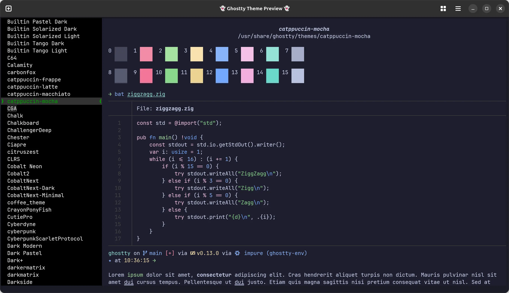

+++
title = 'Cli Tools'
date = 2025-06-28T17:31:29+01:00
draft = true
tags = ['cli', 'tools']
+++
I use a good number of CLI tools every day. I've always got a terminal open and it's my go-to place when I need to do things.

Why? Well, it's fast, it's efficient, and (if you're using good tools) it's pretty bloat-free. Sure you need to remember some commands, but honestly it's worth it.

So I figured I would list out all the tools I'm using. Maybe you'll find it useful, maybe this will be just to remind me what I need to install next time I set up a new environment.

## Ghostty

Key to using the terminal is to have a terminal emulator. I've used a few including [WezTerm](https://wezterm.org) which I really like, but lately I've settled on using [Ghostty](https://ghostty.org). It's really fast, uses a very minimal configuration, and keeps memory usage low. My entire configuration file currently looks like this.

```toml
theme = tokyonight_night

window-height = 40
window-width = 160

font-size = 11

command = /home/linuxbrew/.linuxbrew/bin/nu
```

And this has basically everything I need. It sets my preferred theme (you can explore all the themes by running `ghostty +list-themes`), sets my preferred initial window size, font size, and the shell I want to run (more on that later).



There's a number of features which I've yet to explore, but out of the box I've got tabs, split-right, and split-down, so I'm good to go.

## Nushell

I've used bash for years. I have a Mac for work and so I'm used to zsh there as well. But over the last couple of years I have defaulted to using [nushell](https://www.nushell.sh) instead.

I work with data _a lot_, and having a shell which treats everything as data is certainly a massive benefit. I can do more with the tools built in rather than needing to download other tools such as jq and others.

It's still a young shell and so some of the config is prone to change, but it's not difficult to change, especially as it has recently moved to a "minimal config" approach. This is where it has sensible defaults for all the configurations, and you need to specify what changes you want (this is also Ghostty's approach). Despite being young a lot of the tools I list here have support for it already, so integration is straight forward.

It has a lot of common commands like `ls` and `cd` built in which replace the ones provided by the OS, but you can switch back to them by putting a `^` at the start of the command which tells Nu to use the external command. It also has commands baked in for performing HTTP requests which handle the responses again as data


You can pipe the results from one command to another as you'd expect, but because it's all treated as data, you don't need to convert or reformat in the next command, you can just access the elements.


You can then pipe that result to `save` and it will use the file extension to convert the data to the right type, which you can also read back in again later.


There's great help documentation built-in, and the online docs are very good. I honestly can't recommend Nushell enough, and have been telling everyone I know for quite a while about it.

## Starship

There's so much information you can find out when you're in a directory if you know where to look. If you don't want to look, and want your prompt to look a lot snazzier, then [Starship](https://starship.rs) is a great place to look.

It works on most shells (Nushell included) and can show you information quickly depending on where you are.

Installation is a breeze and you can customise the prompt in lots of ways, but the default configuration is useful all by itself.

Initially, there's not a lot different. It's showing us our location (home in this case), and that's it.


But if we switch to a directory that's got a go module in it, for example.


Well, now we can see the directory we're in. It's showing we're on a Git branch, and we can see we're running Go (via the emoji) and our current Go version.

Now, lets try adding a text file and see what happens.


After I create the file you can see we get a `[?]` in the prompt showing that there are unhandled changes. Staging the file changes it to a `[+]` to indicate that we have staged files ready to commit.

We get other information in other languages as well, for example, if we create a new Python project using [uv](https://docs.astral.sh/uv/) we get the following.


You can see how we go from a simple working directory prompt, to showing our git status, package version, the fact it's Python, and our Python version.

Starship is one of those tools that I don't think about every day, even though I'm using it constantly.

## Btop

There are a lot of good activity monitors out there, and the ones which come with the OS can be pretty decent as well. But if you're in the terminal then you don't really want to leave to check how much resource a process is using, or what your network activity looks like.

For years I've defaulted to using htop (or top at a pinch), but it's always nice to have something better and which looks funky as well. This is where [Btop](https://github.com/aristocratos/btop) comes in.


It's a resource monitor where I can quickly see what my system is up to, filter processes, kill them, and dig into the information of specific processes. Plus it has a range of themes so I can it more personal to me.

There's not a lot more to say really. Go install it and check it out for yourself.

## Ripgrep

This is an absolute powerhouse of a tool and has saved my butt more than once.

[Ripgrep](https://github.com/BurntSushi/ripgrep) is a modern replacement for grep. Which if you don't know, is a search tool that lets you search in files for content matching a regular expression. Ripgrep lets you do the same work, but with some useful improvements, such as honoring git ignore files, skipping hidden files and directories, and skipping binary files. Unless of course you want it to do that, then you can tell it to. It also searches recursively by default, and it's incredibly quick.

Once it's installed you can run it simply by using the `rg` command.


And as you might expect, it will operate over content piped to it as well.


There are lots of options in there to control how it searches, outputs, and more. And just for kicks, here's how you can use it with Nushell to find all files matching an expression, and then order by the number of matches in each file.

`rg -i azure -c | from csv --separator ':' --noheaders | sort-by column1 --reverse | rename file count`

Where `rg -i azure -c` is performing a case-insensitive search (that's the `-i`) for the term "azure", and counting the hits (that's the `-c`). We then convert from csv, but in our case the `:` is the separator, sort by the count, and then rename. Although, I probably should have renamed first to make it easier to read.


## fd

## fzf

## lazygit

## atuin

## carapace

## tldr

## bat

## delta

## just
