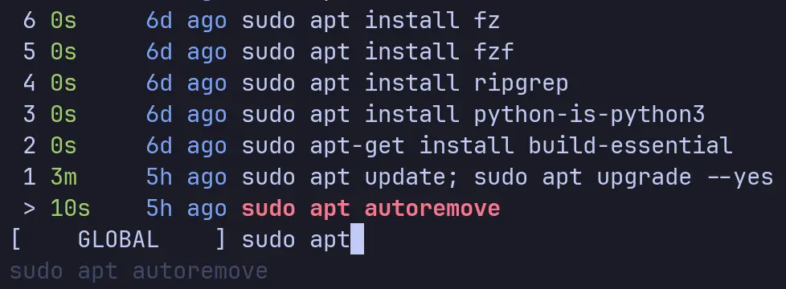

+++
title = 'Cli Tools'
date = 2025-06-28T17:31:29+01:00
tags = ['cli', 'tools']
featured_image = 'btop-full.webp'
+++
I use a good number of CLI tools every day. I've always got a terminal open, and it's my go-to place when I need to do things.

Why? Well, it's fast, it's efficient, and (if you're using good tools) it's pretty bloat-free. Sure, you need to remember some commands, but honestly, it's worth it.

So I figured I would list out all the tools I'm using. Maybe you'll find it useful, maybe this will be just to remind me what I need to install the next time I set up a new environment.

## Ghostty

Key to using the terminal is to have a terminal emulator. I've used a few including [WezTerm](https://wezterm.org), which I really like, but lately I've settled on using [Ghostty](https://ghostty.org). It's really fast, uses a very minimal configuration, and keeps memory usage low. My entire configuration file currently looks like this.

```toml
theme = tokyonight_night

window-height = 40
window-width = 160

font-size = 11

command = /home/linuxbrew/.linuxbrew/bin/nu
```

And this has basically everything I need. It sets my preferred theme (you can explore all the themes by running `ghostty +list-themes`), sets my preferred initial window size, font size, and the shell I want to run (more on that later).


There are a number of features which I've yet to explore, but out of the box I've got tabs, split-right, and split-down, so I'm good to go.

## Nushell

I've used bash for years. I have a Mac for work, and so I'm used to zsh there as well. But over the last couple of years I have defaulted to using [nushell](https://www.nushell.sh) instead.

I work with data _a lot_, and having a shell which treats everything as data is certainly a massive benefit. I can do more with the tools built in rather than needing to download other tools such as jq and others.

It's still a young shell, and so some of the config is prone to change, but it's not difficult to change, especially as it has recently moved to a "minimal config" approach. This is where it has sensible defaults for all the configurations, and you need to specify what changes you want (this is also Ghostty's approach). Despite being young, a lot of the tools I list here have support for it already, so integration is straight forward.

It has a lot of common commands like `ls` and `cd` built in which replace the ones provided by the OS, but you can switch back to them by putting a `^` at the start of the command which tells Nu to use the external command. It also has commands baked in for performing HTTP requests which handle the responses again as data


You can pipe the results from one command to another as you'd expect, but because it's all treated as data, you don't need to convert or reformat in the next command, you can just access the elements.


You can then pipe that result to `save` and it will use the file extension to convert the data to the right type, which you can also read back in again later.


There's great help documentation built-in, and the online docs are very good. I honestly can't recommend Nushell enough and have been telling everyone I know for quite a while about it.

## Starship

There's so much information you can find out when you're in a directory if you know where to look. If you don't want to look and want your prompt to look a lot snazzier, then [Starship](https://starship.rs) is a great place to look.

It works on most shells (Nushell included) and can show you information quickly depending on where you are.

Installation is a breeze, and you can customise the prompt in lots of ways, but the default configuration is useful all by itself.

Initially, there's not a lot different. It's showing us our location (home in this case), and that's it.


But if we switch to a directory, that's got a go module in it, for example.


Well, now we can see the directory we're in. It's showing we're on a Git branch, and we can see we're running Go (via the emoji) and our current Go version.

Now, let's try adding a text file and see what happens.


After I create the file you can see we get a `[?]` in the prompt showing that there are unhandled changes. Staging the file changes it to a `[+]` to indicate that we have staged files ready to commit.

We get other information in other languages as well, for example, if we create a new Python project using [uv](https://docs.astral.sh/uv/), we get the following.


You can see how we go from a simple working directory prompt to showing our git status, package version, the fact it's Python, and our Python version.

Starship is one of those tools that I don't think about every day, even though I'm using it constantly.

## Btop

There are a lot of good activity monitors out there, and the ones which come with the OS can be pretty decent as well. But if you're in the terminal, then you don't really want to leave to check how much resource a process is using or what your network activity looks like.

For years, I've defaulted to using htop (or top at a pinch), but it's always nice to have something better and which looks funky as well. This is where [Btop](https://github.com/aristocratos/btop) comes in.


It's a resource monitor where I can quickly see what my system is up to, filter processes, kill them, and dig into the information of specific processes. Plus, it has a range of themes, so I can make it more personal to me.

There's not a lot more to say really. Go install it and check it out for yourself.

## Ripgrep

This is an absolute powerhouse of a tool and has saved my butt more than once.

[Ripgrep](https://github.com/BurntSushi/ripgrep) is a modern replacement for grep. Which if you don't know, is a search tool that lets you search in files for content matching a regular expression.

Why is it called grep? Go check out [this video](https://youtu.be/iQZ81MbjKpU) from [Laurie Wired](https://lauriewired.com) to find out.

Ripgrep lets you do the same work, but with some useful improvements, such as honouring git ignore files, skipping hidden files and directories, and skipping binary files. Unless of course you want it to do that, then you can tell it to. It also searches recursively by default, and it's incredibly quick.

Once it's installed you can run it simply by using the `rg` command.


And as you might expect, it will operate over content piped to it as well.


There are lots of options in there to control how it searches, outputs, and more. And just for kicks, here's how you can use it with Nushell to find all files matching an expression, and then order by the number of matches in each file.

`rg -i azure -c | from csv --separator ':' --noheaders | sort-by column1 --reverse | rename file count`

Where `rg -i azure -c` is performing a case-insensitive search (that's the `-i`) for the term "azure", and counting the hits (that's the `-c`). We then convert from csv, but in our case the `:` is the separator, sort by the count, and then rename. Although, I probably should have renamed first to make it easier to read.


## fd

Another replacement tool this time for the `find` tool. [fd](https://github.com/sharkdp/fd) is a replacement which offers a simpler syntax, supports regular expressions and glob syntax, ignores hidden files/folders by default, and honours .gitignore files.

I tend to use this a lot when I'm trying to understand code bases, or if I'm using an SDK where the "documentation" is actually just lots and lots of example apps. If I want to find examples of where a certain method or type is being used, then `fd` has my back.

Like `find` you can also use it to execute commands on the results it brings back. For example, if you wanted to find all `.png` files and convert them to `.webp` then you could run the following.

```bash
> fd -e png -x cwebp {} -o {.}.webp
```

This finds all files with the 'png' extension, and then everything after the `-x` is the command to run (which is why you have to specify this last). The `{}` syntax substitutes in the path of the file, and `{.}` is the same, but without the file extension. Check the docs for some more placeholders you can use.

## Zoxide

If you spend any time on the terminal at all, you'll find yourself using `cd` to move directories _a lot_. [Zoxide](https://github.com/ajeetdsouza/zoxide) is a tool that can make that a lot less work by using fuzzy matching to let you specify only a part of the path you want to go to.

Let's say you have some work in a path like `~/go/src/github.com/dazfuller/dotprompt`, but you've opened a clean terminal window, and you're in your home directory. With `cd` you can type all that out, or change directory one at a time to get there.

With Zoxide, though, once you've been there once, it remembers it, and it keeps track of how many times you've been there. So when you open a new terminal window, you could type.

```bash
> z dotp
```

And it will take you straight there.

But what if you have a few locations with very similar or the same names. Well, if it's the one you visit most regularly, then you'll be taken to it. But if you want to go to one of the other ones then you can use `zi` instead which gives you an interactive window where you can list and search through all locations which are similar.

You can, of course, use it as a direct replacement as well and specify the location as you would with `cd`.

I love this tool, mostly because it saves a lot of typing, but also because I can forget where I put things, so this makes it easy to find them again.

## lazygit

There are a handful of commands in `git` which, if you commit them to memory, will get you through about 80% of everything you will ever normally need to do. But we're devs, and we're lazy by nature. So anything that can make using git a little easier is worth it.

[Lazygit](https://github.com/jesseduffield/lazygit) steps in to bring a lot of the power of Git into the hands of us mere mortals. Features like cherry-picking, interactive rebasing, and more become a lot more accessible.

I also really like it for doing the simpler things as well because it looks good, shows me useful information, and is just a lot nicer to use.


Being able to switch branches easily, see remote ones, look at the details of a commit, and even create pull requests are all within easy reach. And if you can't remember the keyboard shortcut, you can just type in question mark `?` and you get an in-app help screen. Press `/` in this and you can search it as well.

I still use the in-tool git features with tools like [Goland](https://www.jetbrains.com/go), but if I'm not using those tools, or I'm just doing most things in a terminal, then this is my go-to.

## atuin

Not to be confused with The Great A'Tuin, the world turtle, upon whose back stand four great elephants who themselves support the Discworld. [Atuin](https://atuin.sh) is a magical shell history tool.

After any time in the command line you'll find yourself hitting `ctrl-r` to search through your command history to find that command you ran that one time, pressing `ctrl-r` again and again and hoping you don't skip past it.



Hitting `ctrl-r` now brings up a list of all the commands and lets me search through them to find the one I want, I can then scroll to it, hit 'enter', and re-run it.

Atuin also supports exporting your history to their service so you can share it between multiple devices. You don't have to do this, or if you want to but don't trust other peoples services (a valid position), then you can run your own instance. The data is end-to-end encrypted, which you would expect given how many of us need to type in secrets as part of running commands, so exporting your history in plain-text would be madness.

There are also commands to let you import your existing history into atuin to get you started.

At the moment I'm running this stand-alone. But I need to create another server soon, so I'll probably start running my own service.

## carapace

I love [carapace](https://carapace.sh)! It's a multi-shell completion library, which contains command line completions for a lot of applications. Can't remember what the sub-command is? Just hit tab and have a look at the options.


Can't remember which arguments are available after you've started typing the command, just hit tab.


It works with tools such as Git as well where it will list commands and branches.

The tool is constantly expanding as well and has a nice way of adding new commands to it, so if you want to add in your favourite tool, you can contribute away.

It integrates nicely with Nushell as well, which is a big bonus for me.

## tldr

I got into the habit a number of years ago of adding in a "tl;dr" section at the top of emails I needed to send out if they got very long. Putting in all the detail is incredibly useful, but sometimes your reader just wants the high-level info so they can get on with their day.

The same can be said about `man` pages. They are incredibly verbose and provide a lot of information, but sometimes you just want a quick pointer. That's the purpose of [tldr-pages](https://github.com/tldr-pages/tldr), which are a collection of community-created and maintained pages for various command line tools with the goal of being straightforward and informative.

There are a number of clients you can use, and even websites. The one I'm using is [tlrc](https://github.com/tldr-pages/tlrc) as it's fast, works well, and can be installed across a lot of different systems.


It will periodically update its database from the pages repo, or you can force an update. And guess what, it's supported by carapace, so if you can't remember the argument, you can just press tab.

Some apps have multiple pages, such as git, where you can ask for help on the main application, or on various commands such as `add`.

I use this a lot as I'm forever forgetting how to use tools if I've not needed them for a couple of months.

## bat

[Bat](https://github.com/sharkdp/bat) is a replacement for the `cat` tool. But that's a little unfair as it can do quite a lot more.

I use it primarily as a replacement for `cat` as it can display the contents of a file with syntax highlighting, line numbers, with the ability to highlight lines.


Bat also integrates with git, so if you look at a file using bat which is version controlled, you'll get line markers showing if things have been added, deleted, modified.

There are a number of additional tools you can get to use bat with other commands, especially git. One of the ones I use is [delta](https://github.com/dandavison/delta) which makes the git log and file differences much nicer to read in the command line.

I've used this tool so often now that it's muscle memory. If I'm on a different environment, I always type in `bat` before remembering I need to run `cat` instead (but only if I can't install bat there).

## hyperfine

Benchmarking tools are incredibly useful, but in all fairness are not something that you might use every day. But when I do need to benchmark something, I will reach for [Hyperfine](https://github.com/sharkdp/hyperfine).

It provides statistical results showing you the runs it performed on the command provided to it, along with suggestions if there are significant outliers. You can tell it to dump the results to multiple formats, set the number of runs, number of warmup runs, pre-run commands, and a lot more.


I use this when I'm building something which needs to perform well. I also use it when I need to demonstrate something to customers, such as the variability in external system responses.

## just

Whilst not the easiest command to search the web for, [just](https://github.com/casey/just) is a command runner which is inspired by `make`.

If I have a project then I probably have a `justfile` for it. This is a file where you define your "recipes", which you want to run. They can be simple, complex, parameterised, have dependencies, and much more.

In fact, I even have one for my website, which looks like this.

```justfile
set dotenv-load

[doc("Run the website locally with all draft posts")]
run:
    hugo server --buildDrafts

[doc("Build the website")]
build:
    hugo

[doc("Remove generated artefacts")]
clean:
    rm -rf ./public

[doc("Deploy the website to the test instance")]
deploy-test: clean
    hugo -D --baseURL $SWA_PREVIEW_NAME
    swa deploy -a ./ -d $SWA_TOKEN -O ./public --env preview

[doc("Deploy the website to the live instance")]
deploy-live: clean
    hugo --baseURL $SWA_LIVE_NAME
    swa deploy -a ./ -d $SWA_TOKEN -O ./public --env Production

[doc("Update robots.txt to disallow AI crawlers")]
update-robots:
    rm ./layouts/robots.txt

    curl -X POST https://api.darkvisitors.com/robots-txts \
        -H "Authorization: Bearer ${DV_API_KEY}" \
        -H "Content-Type: application/json" \
        -d '{ "disallow": "/", "agent_types": [ "AI Data Scraper", "AI Assistant", "AI Search Crawler", "Undocumented AI Agent" ] }' \
        > ./layouts/robots.txt
```

One of the reasons I'm okay sharing this is because 'Just' supports dotenv files, so I have all of my secrets in there. It means I can publish this file along with my code and not worry about accidentally sharing secrets.

You can see that the `deploy` recipes have a dependency on the `clean` recipe, so I can make sure they always run. Each recipe also has a documentation attribute, so I can specify what each one does. This not only helps when you run the `just --list` command.


But it's also supported by carapace, so I can just press 'tab' to list all the recipes.


Using recipes, I can turn commands I need to run often into their own recipes, and I can use them as dependent commands when I create higher-level recipes. Often I do this when I'm creating dotnet applications, and the build and publish commands get quite long. I might want to run a `dotnet clean`, then a `build` or a `publish`, generate a zip file (especially if I'm using Function Apps or Web Apps), and maybe even push that application before I'm ready to create a proper release pipeline.

Just is something I use _every_ single day, along with most of the other tools here. Hopefully there's something I've mentioned which you might find useful, or encourage you to go and find some of your own favourite tools.
