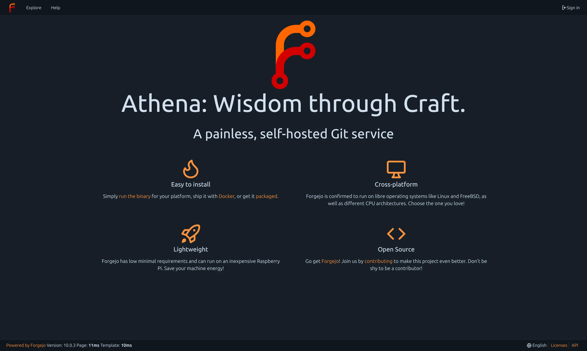
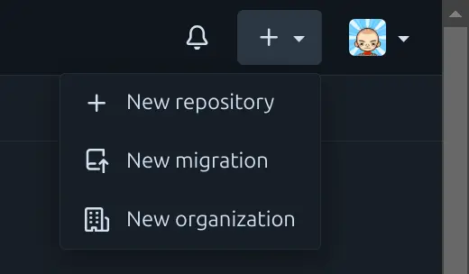
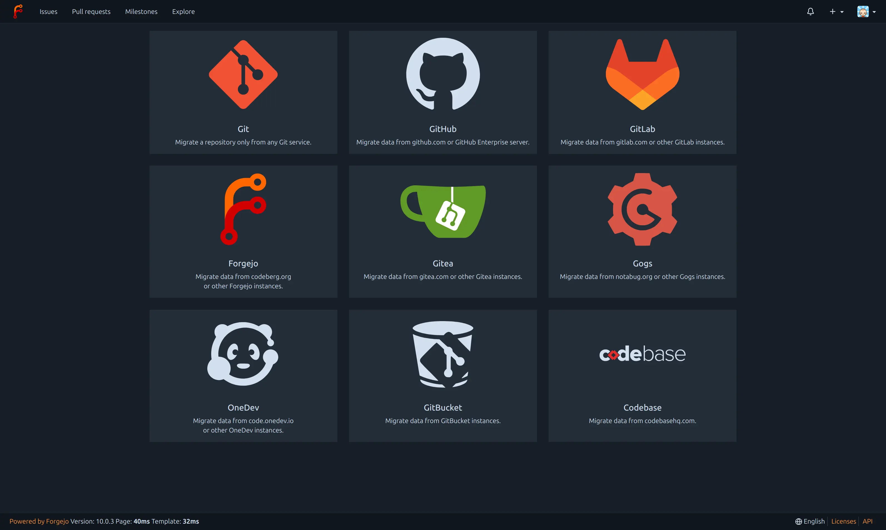
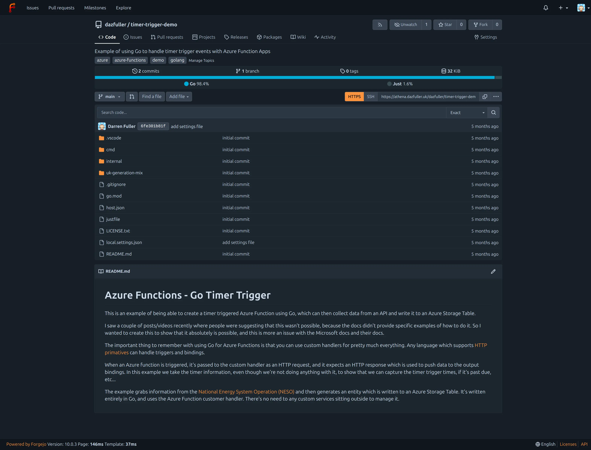

+++
title = 'Setting up a Forgejo Server'
date = 2025-04-13T11:26:58+01:00
featured_image = "viewing-code.webp"
tags = ["Github", "Developing"]
+++
I have a lot of parked projects on GitHub, and a lot of repos which contain examples or snippets that I want to refer back to later. But, this always feels like a bit of a waste, plus with content being scraped to feed the AI machine right now, there's some content I just don't want my copyright being ignored on. So, I started shifting some of my projects to [Codeberg](https://codeberg.org) which provides an equally nice experience, without the additional slop added in recent times. Plus, I get to support an EU based project.

But, I didn't want to just shift a lot of stale rubbish from one place to another, and I still want to have somewhere that isn't my local device to hold code I don't want to lose. So what to do?

Well, as it turns out, Codeberg is a deployed instance of the software powering it called [Forgejo](https://forgejo.org) which is itself a fork of [Gitea](https://about.gitea.com). I'm not going to dive into the history of the fork, so I suggest anyone wanting to run their own does and works out what they're comfortable with. From my reading it seems that Forgejo is better suited to low-power equipment which is what won me over, as I wanted to run this on a [Raspberry Pi Zero 2 W](https://www.raspberrypi.com/products/raspberry-pi-zero-2-w/).

I've written this a little while after setting it up, but wanted to do a write-up to share in case anyone else wakes up one morning with the crazy idea of self-hosting their own Git service.

## Bits I needed

As you might imagine the most obvious piece of kit is the Raspberry Pi. I chose the Zero 2 as it's reasonably well powered, and this isn't a service which anyone other than me will be using. I could always bump this up to a Pi 4 or 5 in the future if I want more power, but for hosting code and a web interface, the Zero 2 is more than enough.

One extra thing I did end up getting is a micro-USB Ethernet adapter. For some reason the Broadcom WiFi interface started having issues which meant my device kept dropping and had to be hard-reset (which isn't fun). I did a temporary work around which would reboot after a while if the network was down, but I wanted something more reliable. The Ethernet adapter I bought (a [VBESTLIFE](https://amzn.eu/d/67cNIWf) one from Amazon) does the job beautifully and was just plug-and-play, the only change needed by me was on my DHCP server as I assigned a static IP address to the device, so needed to switch the MAC address.

So, full kit list for me was:

* Raspberry Pi Zero 2 W
* Suitable case
* Power adapter
* 128Gb Micro SD Card (I went for a class 10)
* Micro-USB Ethernet adapter

If you went for a starter kit, added the SD card and adapter, you'd be looking just under 60 GPB for everything.

## Installation and Configuration

Rather than listing out all of the instructions, I just simply followed the [guide](https://forgejo.org/docs/latest/admin/installation/) from the official website.

Because it's just me I stuck with the default sqlite database rather than setting up anything else. And because it's on a Pi, I went with the binary installation.

Once you've done the install, future updates are pretty straight forward as you just need to copy the binary to the right location and restart the service. Just make sure to back things up first.

One other thing I did was to configure nginx as a proxy. This allowed me to give the instance a custom CNAME record and to then configure an SSL certificate using [LetsEncrypt](https://letsencrypt.org). Why was this important? Well, firstly it's because when I access the Web UI I was getting fed up with the browser telling me that the service wasn't secure. And secondly, it's because Forgejo supports PassKeys, but you can't set them up unless it's over a secure connection (which makes sense right).

Fortunately, once you've installed nginx, you can install Certbot and the Certbot nginx extension and it makes it all very easy.

## User accounts

I could have stuck with the default admin login, but I decided to use that account for site administration, and instead created a standard user account for my actual work. This way I keep my work and admin nice and separate and I'm less likely to accidentally break something.

## Living with it

So, most importantly, what's it like to use?

Well, first thing first was getting some code in. There's a couple of ways to do this, changing the git repo remote and pushing there would be the most obvious. But Forgejo (and Codeberg by extension) has a really nice migration feature.

This lets you migrate code, settings, issues, releases and more from a variety of different hosting platforms.

One of the options you have when migrating is to use the new repository as a mirror instead. What this will do is periodically check the upstream instance and pull those changes. Which is nice if you don't want to fully migrate, but want to have a local instance, just in case.

Regardless the path you choose you end up with a Git repository that looks and feels pretty familiar. In the image below is a view of one of the first repositories I uploaded which was a timer triggered Azure Function app written using Go.

Beyond that you can view the code, create pull requests, review them, create releases, manage issues, add a project wiki and most of the other features you would typically be used to.

If you're wanting to do CI/CD pipelines then you have a few options available, but if you want to stick with how it's configured for Codeberg then have a look at [Woodpecker CI](https://woodpecker-ci.org). I've not done that yet as I figured it might be a bit much for the Pi Zero 2, but I have plans!!

Overall though, it's a really robust application which lets me keep code on my own instance so that I can switch between devices locally. If I'm on the move I can't access because I've not set up any kind of external access, and I'm not likely to if I'm honest, this setup works for me.
