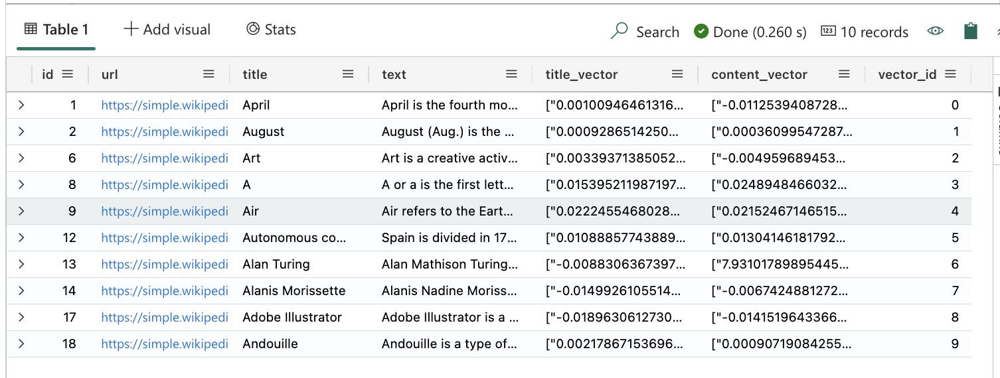
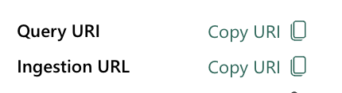
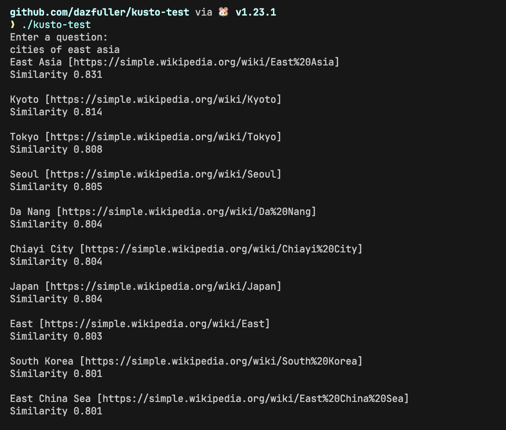

+++
title = 'Microsoft Fabric - Querying using Go'
date = 2024-09-15T16:53:04+01:00
tags = ['fabric', 'golang', 'azure']
+++
I was recently reading an [article](https://techcommunity.microsoft.com/t5/azure-data-explorer-blog/azure-data-explorer-for-vector-similarity-search/ba-p/3819626) on using Azure Data Explorer as a vector store and running similarity searches. I fancied trying it out but wanted to see how easy (or not) it would be to do using [Microsoft Fabric](https://www.microsoft.com/microsoft-fabric) and the [Go SDK](https://github.com/Azure/azure-kusto-go).

Instead of trying to find even more data I decided to use the data referenced in one of the [OpenAI cookbook](https://cookbook.openai.com/examples/vector_databases/kusto/getting_started_with_kusto_and_openai_embeddings) articles talking about using Kusto as a vector database. It's a little out-dated now but it links to a sample data set which contains URLs, titles, content, as well as title and content vectors for articles on [Wikipedia](https://wikipedia.org).

## Parts needed

The original article kind of assumes that you've got and generated embeddings for your question already, and doesn't really show how this factors into the query. So first thing I wanted to connect an [Azure OpenAI](https://azure.microsoft.com/products/ai-services/openai-service) endpoint with a deployed text-embedding-ada-002 model so I could create embeddings for a user-provided question. I also needed to grab the endpoint, but without the full completions path, so it should look something more like this `https://uksouth.api.cognitive.microsoft.com`. I copied this along with the API key into my `.env` file, because then I can share the code for this post without giving away endpoints and credentials :laughing:.

Next up I needed to download the [sample data](https://cdn.openai.com/API/examples/data/vector_database_wikipedia_articles_embedded.zip) from the cookbook article. That article had it as part of a notebook, but I wasn't interested in doing things that way, and just downloaded the zip, extracted it, and then created a new table in Fabric by using the "Get Data" feature and uploading the extracted CSV file (it's a pretty big file, so if you don't have a good internet connection you might want to find a different way). What you end up with though is data which looks like the following.



My Entra account already has access to the Fabric workspace so I planned on using that to query the data, so now I just needed the Query endpoint. If you select the KQL Database in Fabric you'll the "Database Details" tile which contains options for getting the Query and Ingestion URIs.



Clicking on the copy link for the Query URI gets you the endpoint you need. I then copied this into a `.env` file along with the Azure OpenAI details and the name of the database.

## Lets put it together

So first up lets load in the values from the `.env` file. For this I'm using the [godotenv](https://github.com/joho/godotenv) package which makes this pretty easy.

```go
err := godotenv.Load()
if err != nil {
    log.Fatal("Error loading .env file")
}

kustoEndpoint := os.Getenv("KUSTO_ENDPOINT")
kustoDb := os.Getenv("KUSTO_DB")
openAiEndpoint := os.Getenv("AZURE_OPENAI_ENDPOINT")
openAiApiKey := os.Getenv("AZURE_OPENAI_API_KEY")
embeddingsDeployment := os.Getenv("AZURE_OPENAI_EMBEDDINGS")
```

And of course I need to ask the user for a question.

```go
fmt.Println("Enter a question:")

reader := bufio.NewReader(os.Stdin)
question, _ := reader.ReadString('\n')
question = strings.TrimSuffix(question, "\n")
```

Once I've got the basics I want to get the embeddings for the question. To do this I create a function which can query the Azure OpenAI endpoint. I'm using the [Azure SDK for Go](https://github.com/Azure/azure-sdk-for-go/) which includes the Azure OpenAI SDK.

```go
func getQuestionEmbeddings(endpoint string, apiKey string, deployment string, question string) []float32 {
	keyCredential := azcore.NewKeyCredential(apiKey)

	client, err := azopenai.NewClientWithKeyCredential(endpoint, keyCredential, nil)
	if err != nil {
		log.Fatal(err)
	}

	resp, err := client.GetEmbeddings(ctx, azopenai.EmbeddingsOptions{
		Input:          []string{question},
		DeploymentName: &deployment,
	}, nil)

	if err != nil {
		log.Fatal(err)
	}

	return resp.Data[0].Embedding
}
```

This is straight-forward in that it creates a new Key credential (because we're using the API key), creates a new client, and then gets the embeddings for the question. The return is sending back an array of floating point values.

So, now we have our embeddings we need to query the Fabric Kusto instance to get the best matches for the question asked by the user. To do this we're going to use the [series_cosine_similarity](https://learn.microsoft.com/kusto/query/series-cosine-similarity-function) function which, unsurprisingly, uses a cosine similarity method to compare one set of embeddings with another and produces a similarity score. The database contains two series of vectors per record, so we're going to use the `content_vector` field to find articles where the question matches the content rather than the title.

Getting the data back I want to get the content into an internal data structure to make it easier to work with, so first lets create a new struct to hold the values from each row.

```go
type ArticleEntry struct {
	Id         int64   `kusto:"id"`
	Url        string  `kusto:"url"`
	Title      string  `kusto:"title"`
	Text       string  `kusto:"text"`
	Similarity float32 `kusto:"similarity"`
}
```

I'm not getting all the values here as I'm not interested in the vectors after the query. The query is also going to introduce a `similarity` value which I do want back (you'll see this shortly).

The really important part here are the `kust:"id"` tags. Much like querying a database we can read the row into a structure, but as the names don't match our struct we can provide these tags to map the kusto column names to the fields of the struct.

## Querying for data

Okay, lets get some data. First we need to create our Kusto query client, which is pretty simple.

```go
kcs := azkustodata.NewConnectionStringBuilder(kustoEndpoint).WithDefaultAzureCredential()
client, err := azkustodata.New(kcs)
if err != nil {
    panic(err)
}
defer client.Close()
```

Here we create a new connection string builder which uses the endpoint we copied from Fabric earlier. We tell it we want to use the Default credentials provider (note, if falls into using Azure CLI for you and you have access to multiple tenants, then you'll need to switch the CLI to a subscription in the same tenant as your Fabric instance, otherwise you'll get an unauthorized error). Then we create a new client using the created connection string, oh and we defer the call to the `Close` method so we disconnect properly.

Now we can create our query.

```go
params := kql.NewParameters().AddDynamic("question_embeddings", embeddings)

stmt := kql.New("")
stmt.AddTable("wikipedia-articles-embeddings")
stmt.AddLiteral(" | extend similarity = series_cosine_similarity(question_embeddings, content_vector)")
stmt.AddLiteral(" | order by similarity desc")
stmt.AddLiteral(" | limit 10")
```

The `AddLiteral` is a helper method to create Kusto queries in the 1.0.0 preview SDK, you can use it to add lots of different types of value, but right now we're creating a simple query.

`params` here is a parameter collection and we're adding a single parameter to it called `question_embeddings` which is used in the `series_cosine_similarity` function in the main query. We're using the `AddDynamic` method as an array of floating point numbers is a dynamic type which is what the function is expecting, but this means that we're not doing any kind of string interpolation which is normally a bad thing.

We then order by similarity in a descending order so that the closest match is first, and we take the first 10 matches.

Now we can execute the query.

```go
queryResults, err := client.Query(ctx, kustoDb, stmt, azkustodata.QueryParameters(params))
if err != nil {
	log.Fatal(err)
}

primaryMatches := queryResults.Tables()[0]

for _, row := range primaryMatches.Rows() {
	article := ArticleEntry{}
	err = row.ToStruct(&article)
	if err != nil {
		log.Fatal(err)
	}

	fmt.Printf("%s [%s]\nSimilarity %.3f\n\n", article.Title, article.Url, article.Similarity)
}
```

The very first line is the part which executes our query. It takes the database we're executing against, the query itself, and then our parameters. The query returns a number of tables in the results, but it's the first table which contains our result set, so we get that first table.

The for look then iterates over each row and uses the rows `ToStruct` method to read the row values into the struct we created earlier. Then finally we output the results.

A quick `go build` and we can test this out.



This all comes together really quickly and easily, and makes Fabric a service for hosting a vector database store which needs fast retrieval and cloud level scaling.

## Where's the SDK anger?

Yeah okay, I've done a full post here where I've used Microsoft SDKs and haven't complained once about them! The worst thing I encountered here is that the documentation for the Azure Data Explorer SDK wasn't great, it's all there, but not too intuitive.

But don't worry. I've been working with the Purview SDK somewhere else, so there's still plenty for me to complain about :stuck_out_tongue_winking_eye:.

## Full code

So you don't have to piece it all together from the above, here's the full code from this sample.

```go
package main

import (
	"bufio"
	"context"
	"fmt"
	"github.com/Azure/azure-kusto-go/azkustodata"
	"github.com/Azure/azure-kusto-go/azkustodata/kql"
	"github.com/Azure/azure-sdk-for-go/sdk/ai/azopenai"
	"github.com/Azure/azure-sdk-for-go/sdk/azcore"
	"github.com/joho/godotenv"
	"log"
	"os"
	"strings"
)

type ArticleEntry struct {
	Id         int64   `kusto:"id"`
	Url        string  `kusto:"url"`
	Title      string  `kusto:"title"`
	Text       string  `kusto:"text"`
	Similarity float32 `kusto:"similarity"`
}

var ctx = context.Background()

func getQuestionEmbeddings(endpoint string, apiKey string, deployment string, question string) []float32 {
	keyCredential := azcore.NewKeyCredential(apiKey)

	client, err := azopenai.NewClientWithKeyCredential(endpoint, keyCredential, nil)
	if err != nil {
		log.Fatal(err)
	}

	resp, err := client.GetEmbeddings(ctx, azopenai.EmbeddingsOptions{
		Input:          []string{question},
		DeploymentName: &deployment,
	}, nil)

	if err != nil {
		log.Fatal(err)
	}

	return resp.Data[0].Embedding
}

func main() {
	err := godotenv.Load()
	if err != nil {
		log.Fatal("Error loading .env file")
	}

	kustoEndpoint := os.Getenv("KUSTO_ENDPOINT")
	kustoDb := os.Getenv("KUSTO_DB")
	openAiEndpoint := os.Getenv("AZURE_OPENAI_ENDPOINT")
	openAiApiKey := os.Getenv("AZURE_OPENAI_API_KEY")
	embeddingsDeployment := os.Getenv("AZURE_OPENAI_EMBEDDINGS")

	fmt.Println("Enter a question:")

	reader := bufio.NewReader(os.Stdin)
	question, _ := reader.ReadString('\n')
	question = strings.TrimSuffix(question, "\n")

	embeddings := getQuestionEmbeddings(openAiEndpoint, openAiApiKey, embeddingsDeployment, question)

	kcs := azkustodata.NewConnectionStringBuilder(kustoEndpoint).WithDefaultAzureCredential()
	client, err := azkustodata.New(kcs)
	if err != nil {
		panic(err)
	}
	defer client.Close()

	params := kql.NewParameters().AddDynamic("question_embeddings", embeddings)

	stmt := kql.New("")
	stmt.AddTable("wikipedia-articles-embeddings")
	stmt.AddLiteral(" | extend similarity = series_cosine_similarity(question_embeddings, content_vector)")
	stmt.AddLiteral(" | order by similarity desc")
	stmt.AddLiteral(" | limit 10")

	queryResults, err := client.Query(ctx, kustoDb, stmt, azkustodata.QueryParameters(params))
	if err != nil {
		log.Fatal(err)
	}

	primaryMatches := queryResults.Tables()[0]

	for _, row := range primaryMatches.Rows() {
		article := ArticleEntry{}
		err = row.ToStruct(&article)
		if err != nil {
			log.Fatal(err)
		}

		fmt.Printf("%s [%s]\nSimilarity %.3f\n\n", article.Title, article.Url, article.Similarity)
	}
}
```