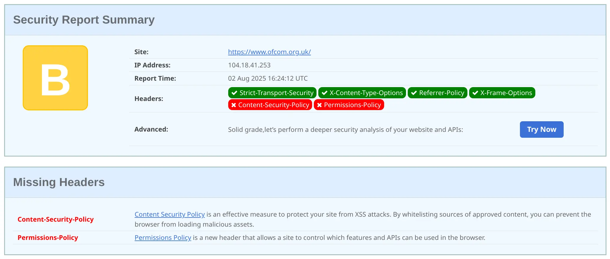
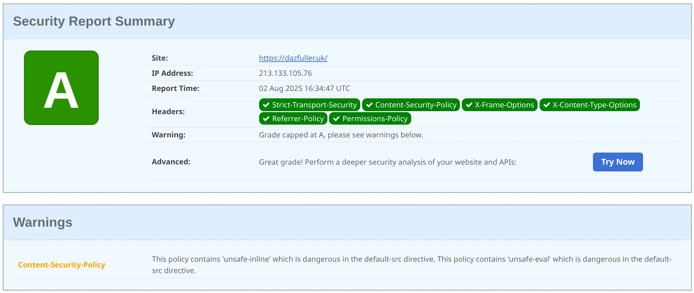

+++
title = 'Switching Provider'
date = 2025-08-02T16:41:25+01:00
tags = ["Developing", "Website"]
+++

There has been a collection of things which have happened lately that has led me to look at this blog and how it's being hosted. Most recently I've become, along with many others, more aware of where services are being hosted, who with, and how these might be used. Personally, it means I've been moving more things to either running locally, such as switching to [Codeberg](https://codeberg.org) and running a [Forgejo server]() locally.

For this blog, as I've mentioned in other posts, it's hosted in Azure as a [Static Web App](https://learn.microsoft.com/azure/static-web-apps/overview) which, other than the [GitHub Actions issue]() has worked pretty nicely. But I wanted to bring it closer to home. So time to look around for a hosting provider which met my rather simplistic set of requirements, those being:

1. Must be UK or EU-based
2. Must allow me to use my existing site content (not redo everything in WordPress or anything else)
3. Allow me to use my own domain name
4. Run for a price which isn't going to get me into trouble at home

Now, it's been quite a while since I needed to do this, and after spending a few hours looking around and going through a bit of analysis paralysis, I decided to ask around online and get some recommendations. The good people of the Fediverse came through, and I got a handful of recommendations pretty quickly, they were.

1. [Hetzner](https://www.hetzner.com)
2. [NetCup](https://www.netcup.com)
3. [HostEurope.de](https://www.hosteurope.de)

Interestingly, they're all German companies! Might just be the audience I found when asking, or maybe something else :shrug:

I spent some time reviewing, and they all met the brief, but I ended up going with Hetzner simply because I got more recommendations for them than the others.

So I went through the sign-up process, said I was using my own domain, and about 10 minutes later I was good to go.

There were a few things I needed to change though, as I would any provider.

## Set up DNS

Yep, DNS, the scourge of the web. I didn't opt to let Hetzner take over the domain registration, so I had to set up DNS myself, which is really not that hard. Hetzner provides a console interface for the site and gives me all the entries I need for the A and AAAA records, so a few changes and it was good. Though naturally, I needed the records to expire so new DNS requests would direct to the right location.

I didn't bother changing from the default site so that when the switch happened, I would know. Normally you wouldn't want to do this, but I know this isn't a high-traffic site, so a little bit of outage isn't an issue.

The static web app previously didn't have an AAAA record, so I guess my blog now supports IPv6, which is nice.

## A bit of security

There's no login for this site, but that doesn't mean I don't need some security. At a bare minimum, the site needs an SSL certificate so that there's an element of trust that the content you're seeing your browser is actually coming from the site and not being intercepted and altered in transit. Hetzner has a really simple configuration for this, I could opt for a standard certificate or a [LetsEncrypt](https://letsencrypt.org) certificate. I opted for LetsEncrypt, which is just a drop-down option, and after a couple of minutes the site had a certificate. I also enabled the "HTTPS Redirect" option, which automatically redirects all requests to the secure endpoint.

## Deployment

With the switch made, I needed to upload the site. [Hugo](https://gohugo.io) builds a `public` folder which contains the full site-generated content. So I fired up [Filezilla](https://filezilla-project.org) (which I've been using since forever), connected using the SFTP credentials provided by Hetzner, and started uploading.

It took a little longer than the static web app, but that's mostly because it's done file-by-file, whereas with static web apps you zip the content, upload a single large file, and then it's extracted at the other end. A single large file can be faster, especially when compared to lots of small files.

But uploaded it was, and the site... just worked.

## Almost done

By default, Azure Static Web Apps set some security headers which hosting providers often don't. Static Web Apps don't do many, but it does do some. So I took the chance to use excellent [Security Headers](https://securityheaders.com) service from [Scott Helme](https://infosec.exchange/@ScottHelme) which shows security headers which should be set, and gives your site a rating.

So, if I run a check against, say, [Ofcom](https://ofcom.org.uk), at the time of writing they get a rating of B.



So I created an `.htaccess` file and started putting in the necessary headers, which currently looks like this.

```text
# Enable Rewrite Engine
RewriteEngine On

# Redirect HTTP to HTTPS
RewriteCond %{HTTPS} off
RewriteRule ^ https://%{HTTP_HOST}%{REQUEST_URI} [L,R=301]

# Enable HSTS
Header always set Strict-Transport-Security "max-age=31536000; includeSubDomains; preload"

# Set Content Security Policy
Header always set Content-Security-Policy "default-src https: data: 'unsafe-inline' 'unsafe-eval'"

# Prevent other sites from using in an iFrame
Header always set X-Frame-Options "SAMEORIGIN"

# Set the content type to 'nosniff'
Header always set X-Content-Type-Options "nosniff"

# Prevent referrer information from being provided when navigating from HTTPS to HTTP
Header always set Referrer-Policy "no-referrer-when-downgrade"

# Set the permissions policy
Header set Permissions-Policy "microphone=(), camera=(), geolocation=(), payment=(), fullscreen=(self)"
```

It needs some more refinement, but right now it gets the site into better shape than it was in before.



## And done

So my site has been migrated. I need to change the upload process for when I publish new posts, but right now the manual process works, so I'll look at that next.

I'm working on a short series of posts, so hopefully they'll start to appear soon. Keep checking back or use the sites' RSS feed to watch for new posts.
