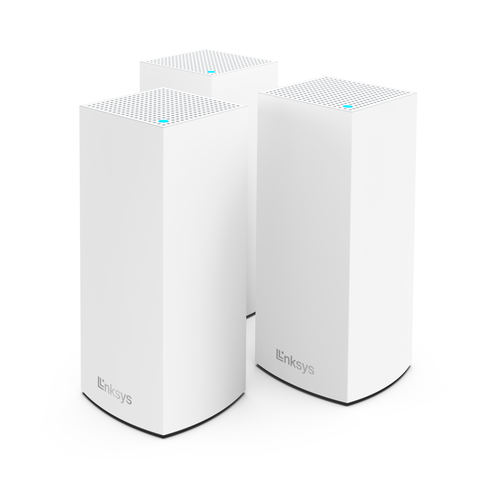
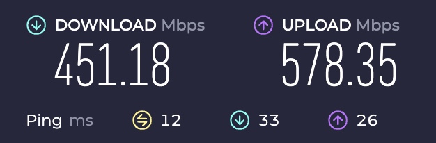
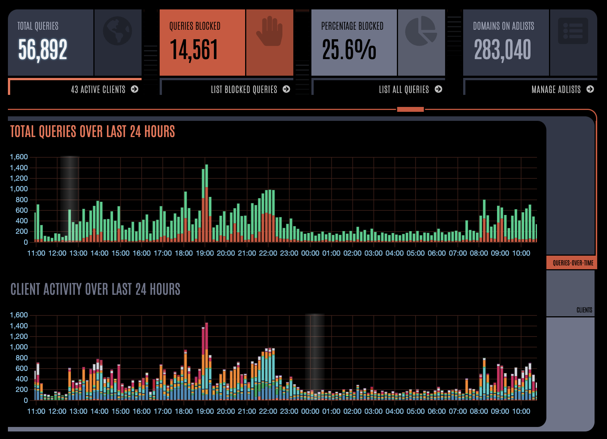

+++
title = 'Velops Network and PiHole config'
date = 2024-04-06T13:51:37+01:00
tags = ['networking', 'pihole']
featured_image = 'velops-network-banner.webp'
+++
## Ol' Faithful

So recently where I live we had a fibre broadband provider install a proper local fibre network, and having gotten fed up of receiving at best around 30Mbps download speeds I signed up. I had an existing mesh network in place using the Google Nest WiFi routers which have been in place and running for years, but with the 600Mb service I'm now getting it was starting to show it's age, with slow internal connectivity and some pretty regular drop outs. But, it had been running successfully for a very long time, so it was a hard decision to say goodbye.

Importantly though, I needed to stick with a mesh network. The house I live in has some pretty thick, straw-filled walls which play havoc with WiFi. So I need a number of devices to overcome this obstacle and ensure everywhere in the house (and a bit outside) gets good coverage.

## Picking a new system

I spent some time looking around at new systems, but given that the new provider had given me a couple of nodes as part of my broadband package I was kind of more swayed in that direction. I knew that the devices were Linksys, what with the branding over them, but not exactly which ones, so I needed to get them booted up so I could check and make sure that I could add more devices. In all it wasn't much of a choice, but the ones I went for are budget friendly, and allow me enough customisation for what I need to do on my network, but more on that later.



After booting up and validating the model number, I could confirm that these were Linksys MX5500 routers which, after some hunting around on the web (my preferred search engine is [DuckDuckGo](https://duckduckgo.com) it turns out that these are actually [Linksys AX5400](https://www.linksys.com/gb/support-product/?sku=MX5502-KE) routers which have been customised for the broadband provider. This added some complexity as I needed to get in touch with the provider to make sure I could add more nodes easily. They were actually really helpful, made sure I was looking at the right devices, and confirmed that I could add more of my own, or rent more from them if I wanted. I took the purchase-my-own option, but it was good to know that they're compatible.

So, I jumped on Amazon, bought a dual pack, and waited for delivery.

## Getting set up

Right, the plan, it's simple. First, I set up the new mesh network, have it parallel run with the existing network, move a couple of devices over, and test it works. This was such a simple plan and lasted all of an hour!

I did actually do all of that, I got the points set up, moved them around the house, made sure they all connected, and then moved a couple of devices over to test. So where did I deviate? Well, the plan was to keep it like that for about a week to test it out, but with the family out and the new devices working _so_ well I thought "sod it" and moved everything!

Moving all of the existing devices is easy. All I had to do was this.

1. Take down the existing network
2. Disable DHCP on the new routers
3. Rename the SSID of the new mesh network to match the old one, and change the password to match the old one as well (this way, when devices boot back up they connect to a known network)
4. Add the PiHole to the network (no config changes needed at this point as I also changed the routers IP address to match the old one)
5. Let all the devices in the house jump back on the network
6. (Hastily added) Move the devices I originally moved to the new network back to the "old" SSID (oops, I would not have been popular if the TV wasn't working when the family got home)

In between all of this there were a number of reboots as well as things like SSIDs got changed, but it was actually pretty smooth.

Before doing all of this I ran a few speed tests from the lounge, which is kind of close to the routers, but the house has some pretty dense walls and so connectivity isn't always great.

On the old network (I've lost the saved images :angry:) I was getting between 80Mpbs and 120Mbps down, and about 40Mbps up. Which when I've got 600mbps broadband isn't great. And at one point I was getting around 30Mpbs down!

With the new devices in place, it's now so much better (and this is why I ended up just moving everything) and I'm getting between 400Mpbs and 500Mpbs down to the device.



## What are these PTR requests I see before me?

So everything is up, running, great speeds across the house :partying_face:. Later that day I drop in to the PiHole to double check that everything is good with the DHCP and on the dashboard I'm suddenly seeing that the number of queries has increased almost 10x! A closer look and it's the new devices making thousands of PTR requests.

For anyone who doesn't know what these are, [CloudFlare](https://www.cloudflare.com/en-gb/learning/dns/dns-records/dns-ptr-record/) has a great piece explaining what they are, but the short version is it's a reverse DNS lookup where a device is attempting to get the domain name associated with an IP address.

I'm no expert when it comes to this level of configuration so this took a lot of digging around until I eventually found a [Discourse post](https://discourse.pi-hole.net/t/fix-velop-mesh-flooding-pi-hole-with-ptr-requests/61381) talking about this exact issue and with the same types of router. I had 1 thing working against me, but also that same thing working for me. **DHCP**.

The child nodes in the mesh network setup all get their IP addresses and DNS settings from the DHCP server, and so when they make their own reverse lookups they all go to the same server as the client device which made the initial DNS request. _But_, you can't edit the device configuration for thei child nodes individually, they just act as "dumb" (they're actually pretty smart) devices. However, having the PiHole as the DHCP server as well means I could make some other changes there to fix this.

All I needed to was to create a new dnsmasq configuration file which would tell each need to revert back to using the router as it's DNS endpoint, which is what they would do in an out-of-the-box setup. In that configuration file you define the router, and then using the MAC address for each of the child nodes (which is easy to find in the PiHole) you define a rule which tells it to use the router.

```lighttpd
# Configuration for: /etc/dnsmasq.d/90-bypass.conf
# 
# Send Velop DNS to router rather than Pi-hole
# The config below is for 3 Velop nodes
# Copy and paste the Velop node sections to add more
#   or delete unwanted sections for fewer

# Define router (replace xxx's with IP address of original router)
dhcp-option=tag:router,6,xxx.xxx.xxx.xxx

# Velop node 1 (replace XX's with node's MAC address)
dhcp-host=XX:XX:XX:XX:XX:XX,set:router

# Velop node 2 (replace XX's with node's MAC address)
dhcp-host=XX:XX:XX:XX:XX:XX,set:router

# Velop node 3 (replace XX's with node's MAC address)
dhcp-host=XX:XX:XX:XX:XX:XX,set:router
```

Once that is done the PiHole needs to be rebooted so the configuration is picked up, then the child nodes need to be rebooted so that they pick up the new DHCP config for them.

After that I left the network alone for a few hours and checked back, and sure enough all of the PTR requests had gone. They're still being made on the network, but now they're not cluttering up the PiHole dashboard (which I've now switched to the Star Trek LCARS theme, love it).



## How is it going

So about a week into the migration now and everything is working really nicely. I'm getting fewer complaints about drop-outs, and when they are happening it's now a problem with the upstream service rather than the network. Occasionally one of the nodes will have an issue connecting, but it's a mesh network and everything reconfigures itself to make sure devices remain connected, and it works really well.

Importantly, the PiHole is operating well and still keeping everything on the network relatively ad and tracker free.
