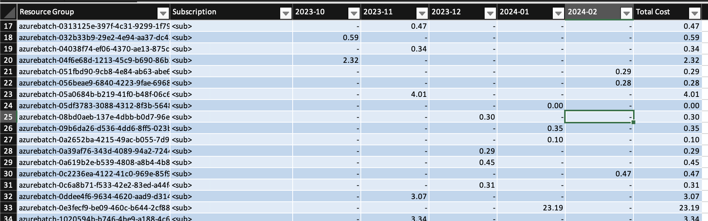

+++
title = 'Azcosts'
date = 2024-03-17T15:11:21Z
tags = ['open source', 'golang', 'azure']
featured_image = 'azcosts-banner.webp'
+++
## What is it?

This was a small command line application I wrote to help keep track of [Azure](https://azure.com) costs. It using the same API as the cost management section of Azure Subscriptions and downloads the data at a resource group level to a local [SQLite](https://sqlite.org) database. The data is downloaded 1 subscription and 1 month at a time, with an option to overwrite the existing data if you collect multiple times in a month. Once the data is collected the app supports exporting the data to text, csv, JSON, and Excel formats, handling the pivoting of data so you can see the change in costs month on month. In a recent version I also added a feature so you can load the data by providing a partial name of the subscription you want, rather than it's id, and if there's more than which matches the name? Well, then it asks you which one you wanted.



Alternatively you can generate and view the data directly in the console.

```text
> azcosts generate -format text -stdout

Resource Group        Subscription              2023-10      2023-11      2023-12      2024-01      2024-02  Total Costs
===================== ==================== ============ ============ ============ ============ ============ ============
ResourceGroup1        My Subscription            239.76       264.56       124.58         5.32         3.29       637.51
ResourceGroup2        My Subscription              8.24         7.97         6.21         7.82         5.44        35.68
ResourceGroup3        My Subscription              0.71         0.00         0.00         0.00         0.00         0.71
ResourceGroup4        My Subscription              0.00         0.00         0.00         0.00         0.00         0.01
ResourceGroup5        My Subscription              0.00         4.74        20.86        28.25        18.51        72.36
```

I used this to learn about creating CLI apps with [Go](https://go.dev), and wanted something practical to work on, and this seemed like a good idea.

Having the costs held locally means that you can build up the data over time and always refer back to it.

Check out the code over at [Github](https://github.com/dazfuller/azcosts "Azure Costs")!
