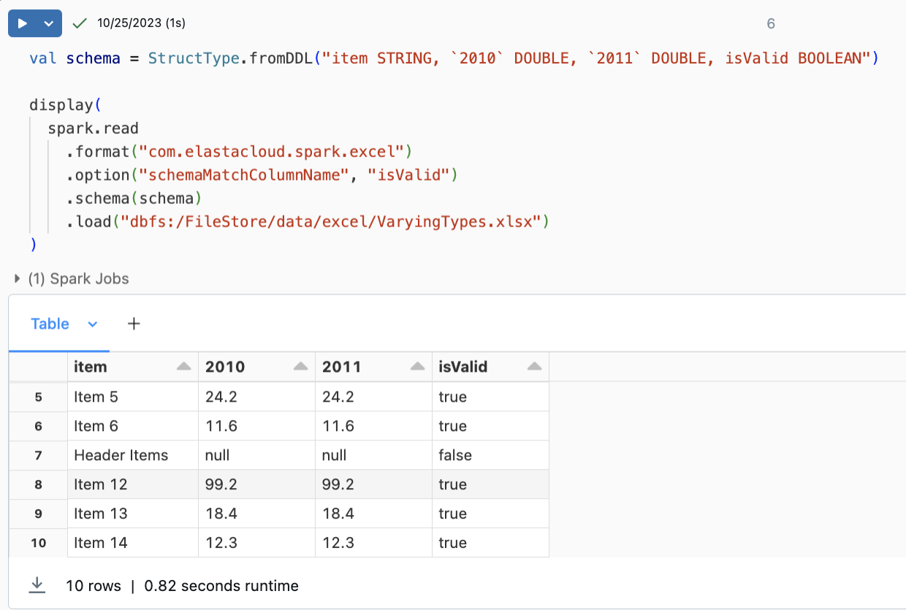
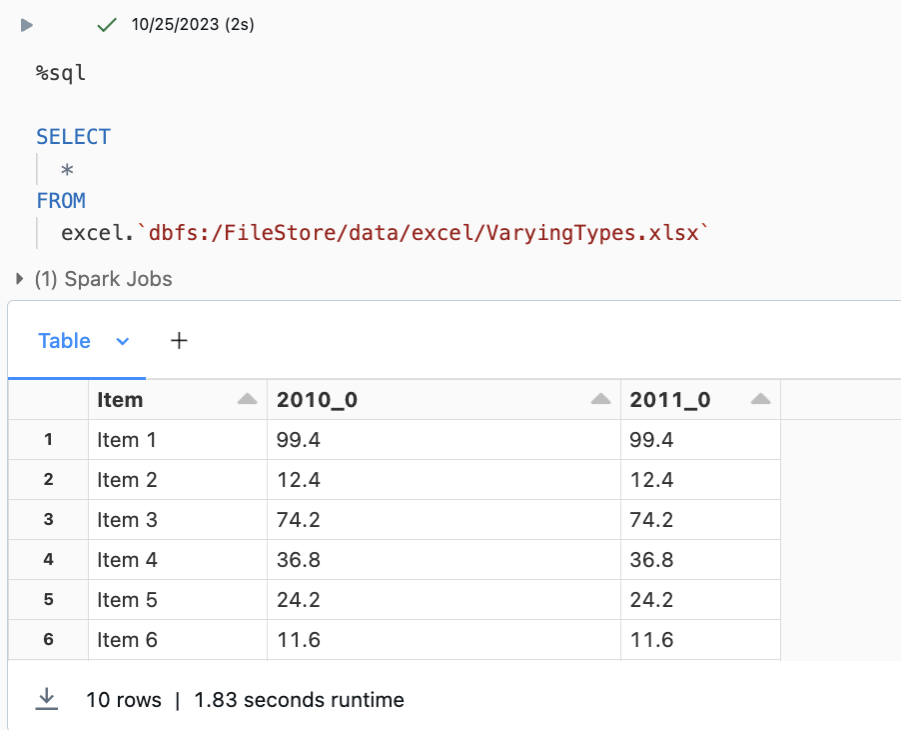
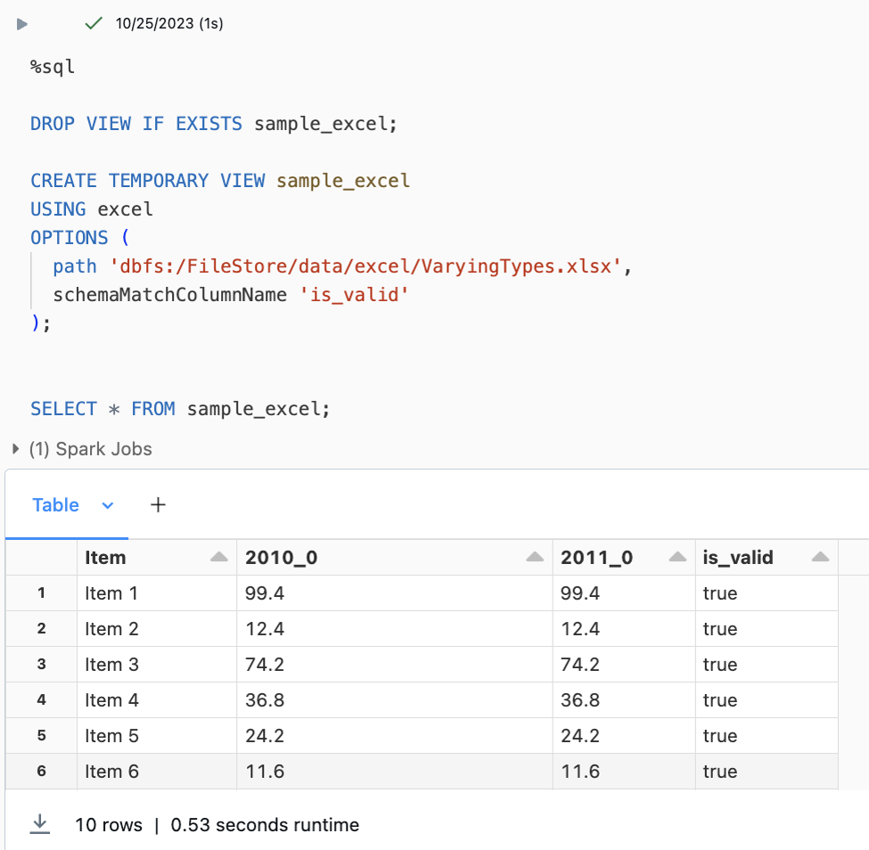

+++
title = 'Spark Excel'
date = 2024-03-17T11:27:04Z
tags = ['open source', 'spark', 'excel', 'scala']
+++
Forever haunted by landing projects which seem to involve lots of Excel files, and wanting to learn more about Spark data sources at the time, I raised a cutlass and did battle with that most terrible of data exchange formats.

## :question: What is it?

I think I might be cursed. Most projects I end up working on seem to involve getting data out of Excel at some point, and often worse, it's needed as part of a big data solution! So, in an effort to make this all a bit easier (and because I wanted learn how Spark data sources worked), I wrote this library to read data in from Excel as a data source directly, rather than needing to use something else like Pandas.

Whilst I was at it, I wanted to add some other features in which I felt were missing elsewhere, like being able to load in multiple sheets from the same workbook which match a given regex. Loading multiple workbooks. Handling merged cells in headers and a few more.

With the library running on a Spark instance the user can run something similar to the following:

```scala
val df = spark.read
  .format("com.elastacloud.spark.excel")
  .option("cellAddress", "A1")
  .option("headerRowCount", 2)
  .option("includeSheetName", value = true)
  .option("sheetNamePattern", """Sheet[13]""")
  .load("/path/to/files/*.xlsx")
```

Which will load all `.xlsx` files in the directory given and, for each sheet matching the regular expression pattern `Sheet[13]`, it will read the data starting from cell `A1`, it will read the first 2 rows as the header, and from this it will read all the data. The "includeSheetName" means that a new column is added to the data frame which includes the name of the sheet the data came from, which is useful if the sheet name contains information giving the data context.

One of the features came as a request from a user who wanted the library to be able to add a new row to the output that simply flagged if the record matched the expected schema or not. Spark has a few options when reading such as `PERMISSIVE` or `FAIL_FAST` which let you capture what you can, or just stop processing the data if there's an issue, but when using permissive mode you need to check the data after to see if it's valid, whereas with this feature the user can simply check a boolean column for data which is schema correct or not.



And with this being a Spark data source (using the DataSourceV2 api) it means that it's available in all of the languages, so users can read Excel using PySpark, and they can use Spark-SQL.



Or if the user wants to use the available options then they can create a view and read from that instead.



There's still very little (good) information out there on writing Spark data sources, and even less on using the v2 APIs, So this is all licensed under the [Apache V2](https://www.apache.org/licenses/LICENSE-2.0.html) license so hopefully other people can learn from it. Especially around things like schema inference which are incredibly badly documented.

## Want to find out more?

Check out the code over at [Github](https://github.com/elastacloud/spark-excel "Spark Excel"), or even contribute if you fancy giving it a go.
